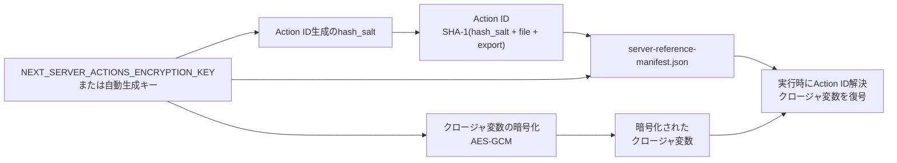
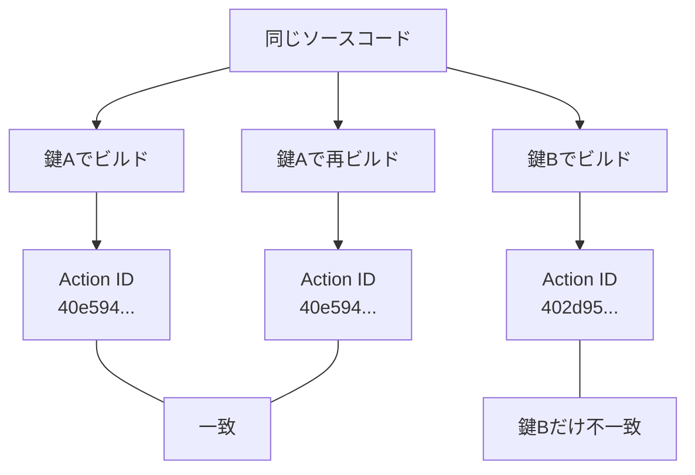
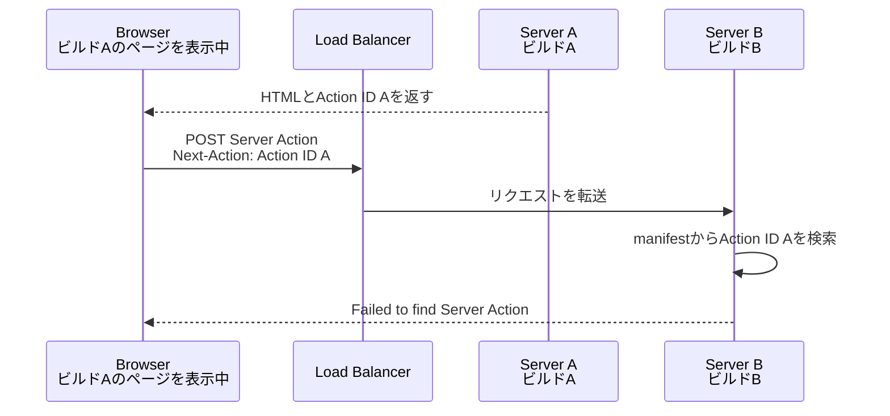

**TL;DR**

- `NEXT_SERVER_ACTIONS_ENCRYPTION_KEY`は、Server Actionsのクロージャ変数を暗号化する鍵を固定するための環境変数
- 実装を読むと、クロージャ変数の暗号化キーはAction IDを生成するハッシュのソルトとしても使われていた。実際に鍵だけを変えてビルドし、Action IDが変わることを確認した
- 複数インスタンスや複数回ビルドが走る構成では、`openssl rand -base64 32`で生成した鍵を、ビルド時に環境変数`NEXT_SERVER_ACTIONS_ENCRYPTION_KEY`として渡して固定する

## Server Actionが「見つからない」のに、対策は暗号化キー？

セルフホストしたNext.jsを複数インスタンスで運用していると、「Failed to find Server Action」というエラーに遭遇することがあります。公式の[self-hostingガイド](https://nextjs.org/docs/app/guides/self-hosting#server-functions-encryption-key)を引くと、対策として次の一文が置かれています。

> Set a consistent encryption key using the `NEXT_SERVER_ACTIONS_ENCRYPTION_KEY` environment variable.

環境変数`NEXT_SERVER_ACTIONS_ENCRYPTION_KEY`を設定すれば良い、というのは読み取れます。でも、この環境変数はいったい何を暗号化しているのでしょうか。そして、暗号化の鍵を固定しないと、なぜServer Actionが「見つからなく」なるのでしょうか。復号に失敗するならまだしも、返ってくるのは「見つからない」というエラーです。私はここが腑に落ちず、実装を調べてみることにしました。この記事は、その調査の記録です。

## 対処法：ビルド時に鍵を固定する

結論を急ぐ方のために、先に対処法から書きます。鍵は公式ドキュメントの案内どおり、OpenSSLで生成します。

```bash
$ openssl rand -base64 32
F4IonZhUuuDR/Qh3vW4jSzskh2h1KKOWt1I2yyfzgUE=
```

生成した値は、base64デコード後の長さがAESの鍵長として有効な16バイト、24バイト、32バイトのいずれかである必要があります。Next.jsのデフォルト生成も32バイトで、実際に上の出力をデコードして数えると、たしかに32バイトありました。

```bash
$ echo "F4IonZhUuuDR/Qh3vW4jSzskh2h1KKOWt1I2yyfzgUE=" | base64 -d | wc -c
32
```

これをビルド時の環境変数として渡します。公式ドキュメントが示しているのは次のCLI例になります。

```bash
NEXT_SERVER_ACTIONS_ENCRYPTION_KEY=your-generated-key next build
```

Dockerでビルドするなら、BuildKit secretとして渡すのが良いかと思います。`ARG`や`ENV`で渡すと、鍵がイメージの履歴に残ってしまうためです。この鍵はビルド成果物に埋め込まれるため、少なくともビルド時には参照できる必要があります。

```dockerfile
# syntax=docker/dockerfile:1.7

RUN --mount=type=secret,id=next_server_actions_encryption_key \
  NEXT_SERVER_ACTIONS_ENCRYPTION_KEY="$(cat /run/secrets/next_server_actions_encryption_key)" \
  npm run build
```

CI（GitHub Actions）からSecretsとして渡すならこうなります。

```yaml
- run: |
    docker build \
      --secret id=next_server_actions_encryption_key,env=NEXT_SERVER_ACTIONS_ENCRYPTION_KEY \
      .
  env:
    NEXT_SERVER_ACTIONS_ENCRYPTION_KEY: ${{ secrets.NEXT_SERVER_ACTIONS_ENCRYPTION_KEY }}
```

固定が必要になるのは、同じServer Actions定義から複数回ビルドされた成果物が同時に動く構成です。サーバー側で同時に動いていなくても、古いビルドのページをブラウザで開いたままのユーザーがいれば、同じ状況になります。

- **新旧ビルドが同時にリクエストを受ける**：ローリングデプロイやCanaryリリースで、ロードバランサの振り分け先に新旧が混在する
- **デプロイの前後をまたぐ**：Blue/Greenの切り替えや単一サーバーへの逐次デプロイで、切り替え前に開かれたページからServer Actionが呼ばれる
- **同一コミットから複数回ビルドされる**：環境ごとにDockerイメージを作り直す、ビルドジョブやタスク定義ごとにビルドが分かれるなど、インスタンス間で成果物が別ビルドになるCI/CD構成

一方で、Vercelのようにプラットフォーム側が1つのビルド成果物を一貫して配る環境では、通常この環境変数を自分で設定する必要はありません。

鍵を固定しないと、ビルドキャッシュが共有されない環境ではビルドごとに異なる鍵が生成され、インスタンス間で暗号化まわりの整合性が取れなくなります。そして、鍵がずれたときに壊れる仕組みは1つにとどまりません。ここから先は、それが何なのかを実装とビルド成果物で確かめていきます。

先に全体像を図にしておきます。読み進めて迷子になったら、ここに戻ってきてください。



## Action IDはどう作られているのか

まず全体の流れから整理します。

```text
Client
  │  <form action={updateUser}>
  ▼
POST (Action IDをヘッダーに含む)
  │
  ▼
Server: Action IDから対応するServer Actionを解決
  │
  ▼
Server Actionを実行
```

クライアントは関数そのものではなく、ビルド時に発行された「Action ID」を使ってサーバーにPOSTします。実際のリクエストでは、このIDは`Next-Action`ヘッダーに入ります。サーバーはそのIDから、実行すべき関数を特定するわけです。

このAction IDは、Next.jsのRustコンパイラにある[server_actions.rs](https://github.com/vercel/next.js/blob/1bd2fd585aac793ca2589e6f18f17a412fd11005/crates/next-custom-transforms/src/transforms/server_actions.rs)の`generate_server_reference_id`関数が生成します。該当部分を抜粋・簡略化します。

```rust:crates/next-custom-transforms/src/transforms/server_actions.rs
let mut hasher = Sha1::new();
hasher.update(self.config.hash_salt.as_bytes());
hasher.update(self.file_name.as_bytes());
hasher.update(b":");
// export_name（識別子 or 文字列）を追加
hasher.update(export_name_bytes);
```

`hash_salt + file_name + ":" + export_name`をSHA-1でハッシュ化し、先頭に「cache関数かどうか」「引数の使用状況」などを表す1バイトを付加してhex文字列化したものがAction IDです。

公式の[data-securityガイド](https://nextjs.org/docs/app/guides/data-security)は、Action IDを次のように説明しています。

> **Secure action IDs:** Next.js creates encrypted, non-deterministic IDs to allow the client to reference and call the Server Action. These IDs are periodically recalculated between builds for enhanced security.

「non-deterministic（非決定的）」「ビルド間で定期的に再計算される」とあります。でも、ハッシュの入力はソルトとファイル名と関数名でした。ソースコードを変えていないのに、いったい何が「非決定的」なのでしょうか？　この疑問には後の節で答えます。

## もう1つの仕組み：クロージャ変数の暗号化

Action IDは「どの関数を呼ぶか」しか表現できません。では、Server Actionが外側のスコープの変数を参照している場合はどうなるのでしょうか。

```tsx
export default async function Page() {
  const userId = "123" // クロージャで捕捉される値

  async function updateUser() {
    "use server"
    await update(userId)
  }

  return <form action={updateUser}>...</form>
}
```

この`userId`はレンダリング時に決まる値です。ところが、Server Actionが実際に実行されるのは、ユーザーがフォームを送信した「あと」です。サーバーはリクエストをまたいでこの値を覚えていないので、一度クライアントに送っておいて、Server Action実行時にサーバーへ送り返してもらうしかありません。

そのまま送り返させるとどうなるでしょうか。捕捉した値が機密情報（内部IDやトークンなど）だった場合、クライアントから丸見えになります。そこでNext.jsは、この値を自動で暗号化してから送ります。`data-security`ガイドの記述はこうです。

> To prevent sensitive data from being exposed to the client, Next.js automatically encrypts the closed-over variables. A new private key is generated for each action every time a Next.js application is built.

実装は[encryption.ts](https://github.com/vercel/next.js/blob/1bd2fd585aac793ca2589e6f18f17a412fd11005/packages/next/src/server/app-render/encryption.ts)の`encryptActionBoundArgs`/`decryptActionBoundArgs`にあります。捕捉した変数をReact Flight（値を文字列に変換するReact内部の仕組み。JSONへの変換のReact版のようなものです）でいったん文字列にし、[encryption-utils.ts](https://github.com/vercel/next.js/blob/1bd2fd585aac793ca2589e6f18f17a412fd11005/packages/next/src/server/app-render/encryption-utils.ts)の`encrypt`/`decrypt`がAES-GCM（`crypto.subtle.encrypt`/`decrypt`）で暗号化します。暗号化のたびに、IV（初期化ベクトル）と呼ばれる16バイトのランダム値も新しく生成されます。これは、同じ変数を暗号化しても毎回違う暗号文を作るための値で、暗号文から中身を推測されづらくする役割を持ちます。

## その鍵はいつ、どこで生まれるのか

暗号化に使う鍵を用意するのは、[encryption-utils-server.ts](https://github.com/vercel/next.js/blob/1bd2fd585aac793ca2589e6f18f17a412fd11005/packages/next/src/server/app-render/encryption-utils-server.ts)の`generateEncryptionKeyBase64`です。該当部分を抜粋・簡略化します。

```typescript:packages/next/src/server/app-render/encryption-utils-server.ts
const CONFIG_FILE = '.rscinfo'
const EXPIRATION = 1000 * 60 * 60 * 24 * 14 // 14 days

export async function generateEncryptionKeyBase64({ isBuild, distDir }) {
  if (!__next_encryption_key_generation_promise) {
    __next_encryption_key_generation_promise = loadOrGenerateKey(
      distDir,
      isBuild,
      async () => {
        const providedKey = process.env.NEXT_SERVER_ACTIONS_ENCRYPTION_KEY

        if (providedKey) {
          return providedKey
        }
        const key = await crypto.subtle.generateKey(
          { name: 'AES-GCM', length: 256 },
          true,
          ['encrypt', 'decrypt']
        )
        const exported = await crypto.subtle.exportKey('raw', key)
        return btoa(arrayBufferToString(exported))
      }
    )
  }
  return __next_encryption_key_generation_promise
}
```

環境変数`NEXT_SERVER_ACTIONS_ENCRYPTION_KEY`があればそれを返し、なければAES-GCM 256bitの鍵を生成してbase64にする、という流れがそのまま読み取れます。`loadOrGenerateKey`は、生成した鍵を`.rscinfo`ファイル（`CONFIG_FILE`）に書き込み、`EXPIRATION`が示す14日間キャッシュする役割です。

挙動は次のとおりです。

- 環境変数`NEXT_SERVER_ACTIONS_ENCRYPTION_KEY`が設定されていれば、それを最優先で使う（キャッシュ済みの鍵と食い違っても環境変数が勝つ）
- 未設定なら、AES-GCM 256bitの鍵を新規生成し、`.rscinfo`というキャッシュファイルに書き込む（有効期限14日）
- `distDir`配下の永続キャッシュが残る環境では、14日以内の再ビルドで同じ鍵が再利用される。CIなどキャッシュが毎回消える環境では、ビルドごとに新しい鍵が生成される

先ほど引用した「A new private key is generated ... every time a Next.js application is built」という公式の説明は、キャッシュが効かない場合や期限切れの場合の挙動を指しています。[data-securityガイドの補足](https://nextjs.org/docs/app/guides/data-security#built-in-server-actions-security-features)にも「created during compilation and are cached for a maximum of 14 days（コンパイル時に生成され、最大14日間キャッシュされる）」とあります。

ここまでで、Action IDとクロージャ変数の暗号化キーという2つの仕組みを見てきました。公式ドキュメント上、この2つは独立した機能として説明されています。ところが、実装を読むとそうではありませんでした。

## Action IDのソルトには何が渡されているのか

Next.jsのビルドにはTurbopackとwebpackの2系統があり、Action IDを生成するコンパイラへの設定も、それぞれの経路で組み立てられます。まずTurbopack経路の[生成部分](https://github.com/vercel/next.js/blob/1bd2fd585aac793ca2589e6f18f17a412fd11005/crates/next-core/src/next_shared/transforms/server_actions.rs)です。`hash_salt`に何が代入されているか、見てください。

```rust:crates/next-core/src/next_shared/transforms/server_actions.rs
Config {
    is_react_server_layer: self.is_react_server_layer,
    is_development: self.mode.is_development(),
    use_cache_enabled: self.use_cache_enabled,
    hash_salt: self.encryption_key.await?.to_string(),
    cache_kinds: self.cache_kinds.owned().await?,
},
```

`hash_salt: self.encryption_key.await?.to_string()`。Action IDのハッシュソルトに、暗号化キーそのものが渡されています。別々の仕組みだと思って追いかけてきた2つが、ここで同じ値につながりました。これは意外でした。

webpack経路も同様です。[webpack-config.ts](https://github.com/vercel/next.js/blob/1bd2fd585aac793ca2589e6f18f17a412fd11005/packages/next/src/build/webpack-config.ts)が暗号化キー（`encryptionKey`変数）を`serverReferenceHashSalt`として渡し、[swc/options.ts](https://github.com/vercel/next.js/blob/1bd2fd585aac793ca2589e6f18f17a412fd11005/packages/next/src/build/swc/options.ts)がそれを`hashSalt`としてコンパイラに設定しています。つまり、どちらのビルド経路でも、**Action IDのハッシュソルトと、クロージャ変数の暗号化キーは同一の値**です。

これで前の節に残していた疑問がスッキリします。公式がAction IDを「non-deterministic」「ビルド間で再計算される」と説明していたのは、ビルドごとに変わりうる暗号化キーがソルトに入るからでした。Action IDの補足にある「最大14日間キャッシュ」という日数が`.rscinfo`の期限とぴったり一致するのも、両者が同じ値を共有しているためです。

## 鍵を変えてビルドすると本当にAction IDは変わるのか

ソースコード上はそう読める、で終わらせたくなかったので、実際にビルドして確かめました。クロージャを持つServer Actionを1つだけ含む最小構成のアプリを用意し、ソースコードには一切手を触れずに、鍵を変えながら`next build`を3回実行します。Action IDはビルド成果物の`.next/server/server-reference-manifest.json`に記録されるので、そこを比較すればよいわけです。

```bash
# 1回目：鍵Aでビルド
$ NEXT_SERVER_ACTIONS_ENCRYPTION_KEY=$KEY_A npx next build

# 2回目：.next を消して、同じ鍵Aでもう一度ビルド（対照実験）
# 3回目：.next を消して、別の鍵Bでビルド
```

3回のビルドでmanifestに記録されたAction IDは次のようになりました。



| ビルド | Action ID |
|---|---|
| 鍵A | `40e594ca6f76e56927cce395e55d2e17aea6b79712` |
| 鍵A（再ビルド） | `40e594ca6f76e56927cce395e55d2e17aea6b79712` |
| 鍵B | `402d95864fe82a1df1a9833dc1fee813ab1c79fc26` |

同じ鍵なら、`.next`を消してビルドし直してもAction IDは完全に一致しました。鍵を変えると、ソースコードが同一でもIDが変わっています。どちらのIDも先頭バイトが`40`で一致しているのは、前述の「先頭に付加される1バイト」が関数の属性（cache関数かどうか、引数の使用状況）を表すためで、同じ関数なら鍵が変わってもこの部分は変わりません。ハッシュ部分だけがソルトに応じて変わるという、実装の説明どおりの結果です。

もう一つ、このmanifestには`encryptionKey`というフィールドがあり、そのビルドで使われた鍵そのものが入っていました。環境変数`NEXT_SERVER_ACTIONS_ENCRYPTION_KEY`を設定してビルドした場合は、設定した値がそのまま入ります。ランタイムは実行時の環境変数を先に見ますが、未設定ならこのmanifestの値を使ってクロージャ変数を復号するため、ビルド時に鍵を渡していれば実行時に改めて設定する必要はありません。鍵はビルド時に決まり、成果物と一緒にサーバーへ配られる。このことが、ここからも確認できます。

## 鍵を固定しないと何が起きるのか

ここまでの確認を踏まえて、冒頭のエラーに戻ります。self-hostingガイドは、複数インスタンスでの挙動をこう説明しています。

> When running multiple server instances, all instances must use the same encryption key. Otherwise, a Server Function encrypted by one instance cannot be decrypted by another, causing "Failed to find Server Action" errors.

文面どおりに読めばクロージャの復号失敗の話ですが、ここまでの内容を踏まえると、エラーに至る経路は2つあります。

1. 暗号化キーが異なるため、クロージャ変数を復号できない
2. 暗号化キー（＝hash_salt）が異なるため、そもそもインスタンス間でAction ID自体が一致しない

この一文で直接説明しているのは1だけです。しかし2の前提となる「鍵が違えばAction IDが変わる」ことは、前節の実ビルドで確認できました。インスタンスAのページが配ったAction IDを別ビルドのインスタンスBが受け取っても、BのmanifestにそのIDは存在しないため、対応するServer Actionを解決できません。実際のエラーとしては、ビルドAのページをブラウザで開いたまま、Server ActionのPOST先がビルドBに向く状況を作ると再現できる可能性が高いです。本記事ではそこまでの再現検証は行っていませんが、経路2が成立することはビルド成果物のレベルで裏付けられました。

この流れを図にすると次のようになります。



この状況は、複数インスタンスを並べていなくても起こります。たとえばServer Actionsとは無関係の変更を何度かデプロイしたあとに、古いビルドの時点からページを開きっぱなしにしているユーザーがServer Actionを呼び出すケースです。POSTを受け取るのは最新ビルドのサーバーなので、鍵が固定されていなければAction IDを解決できず、同じエラーになります。鍵を固定していれば、Server Actionのファイルパスと関数名が変わらない限りAction IDはビルドをまたいで一致するため、開きっぱなしの画面からの呼び出しも成立します。

なお、ユーザーがページをリロードすれば最新ビルドのAction IDを取得し直すため、この不一致は解消されます。問題は、開きっぱなしの画面がいつリロードされるかを、サーバー側からは制御できないことです。これに対してNext.jsは、不一致を検出してページを自動リロードさせる`deploymentId`という仕組みを別途用意しています。鍵の固定とは対処できるケースが異なり、併用することで互いを補えますが、本記事の主題から外れるため、詳細は[self-hostingガイドのVersion Skew](https://nextjs.org/docs/app/guides/self-hosting#version-skew)に譲ります。

冒頭の対処法に戻ると、ビルド時に鍵を固定する設定は、この2つの経路を同時に塞いでいることになります。

## まとめ

| 項目 | 内容 |
|---|---|
| Action ID | `hash_salt + file_name + ":" + export_name`のSHA-1ハッシュに、関数の属性を表す1バイトを前置したもの |
| クロージャ変数 | AES-GCMで暗号化。鍵は`NEXT_SERVER_ACTIONS_ENCRYPTION_KEY`または自動生成 |
| 両者の関係 | hash_saltと暗号化キーは同一の値 |
| 実ビルドでの確認 | 鍵だけを変えてビルドするとAction IDが変わる。同じ鍵なら`.next`を消して再ビルドしても一致 |
| 固定が必要な場面 | 同じAction定義を含む別ビルドが共存する構成、複数ビルドジョブなど |

`NEXT_SERVER_ACTIONS_ENCRYPTION_KEY`は、クロージャ変数を復号するためだけの設定ではなく、Action IDの一致にも関わる設定でした。セルフホストで複数インスタンスを動かしている、あるいはCIで同一コミットを複数回ビルドしているなら、`next build`に鍵を渡しているかを一度確認してみてください。

## 参考資料

- [How to think about data security in Next.js](https://nextjs.org/docs/app/guides/data-security#overwriting-encryption-keys-advanced)
- [How to self-host your Next.js application](https://nextjs.org/docs/app/guides/self-hosting#server-functions-encryption-key)
- [crates/next-custom-transforms/src/transforms/server_actions.rs](https://github.com/vercel/next.js/blob/1bd2fd585aac793ca2589e6f18f17a412fd11005/crates/next-custom-transforms/src/transforms/server_actions.rs)
- [crates/next-core/src/next_shared/transforms/server_actions.rs](https://github.com/vercel/next.js/blob/1bd2fd585aac793ca2589e6f18f17a412fd11005/crates/next-core/src/next_shared/transforms/server_actions.rs)
- [packages/next/src/server/app-render/encryption.ts](https://github.com/vercel/next.js/blob/1bd2fd585aac793ca2589e6f18f17a412fd11005/packages/next/src/server/app-render/encryption.ts)
- [packages/next/src/server/app-render/encryption-utils.ts](https://github.com/vercel/next.js/blob/1bd2fd585aac793ca2589e6f18f17a412fd11005/packages/next/src/server/app-render/encryption-utils.ts)
- [packages/next/src/server/app-render/encryption-utils-server.ts](https://github.com/vercel/next.js/blob/1bd2fd585aac793ca2589e6f18f17a412fd11005/packages/next/src/server/app-render/encryption-utils-server.ts)
- [カミナシ Developers Blog「Next.jsのコンパイラから知るServer Actionsの完全解析」](https://kaminashi-developer.hatenablog.jp/entry/nextjs-server-actions)
