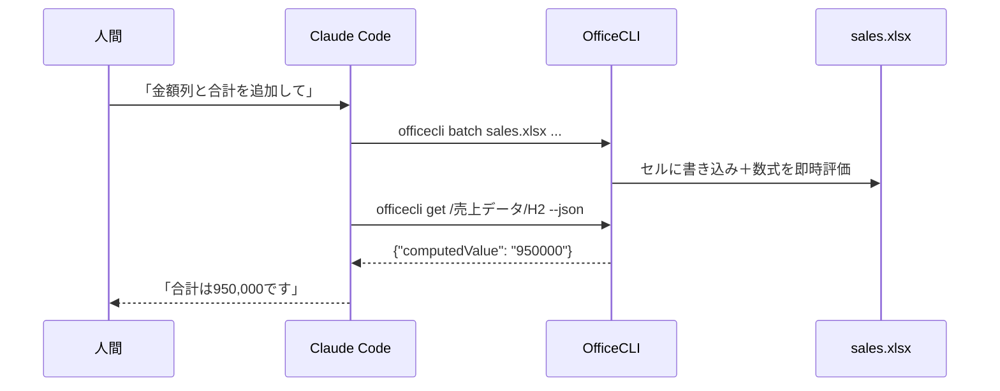

## はじめに

毎月の集計表づくりやフォーマットの整え直しなど、定型的なExcel作業が日常的に発生していて、正直ずっと面倒だと思っていました。コードはClaude Codeに任せられるのに、Excelだけは自分の手で編集している。この状況を解消できそうなツールを見つけたので、実際に試した結果をまとめます。

[OfficeCLI](https://github.com/iOfficeAI/OfficeCLI) は、Word / Excel / PowerPointのファイルをコマンドラインから読み書きできる、AIエージェント向けに設計されたオープンソースのCLIツールです。この記事ではExcel（xlsx）に絞って、Claude Codeと組み合わせたときに何ができるのかを実際に動かしながら確かめます。

先に言ってしまうと、一番驚いたのは数式の扱いです。ふつうはプログラムからxlsxに数式を書き込んでも、実際に計算されるのはExcelでファイルを開いたとき。OfficeCLIは書き込んだ瞬間に計算まで済ませるので、Excelを一度も開かずに合計値を確認できます。

検証環境は以下のとおりです。

- OfficeCLI 1.0.136
- macOS（Apple Silicon）
- Claude Code 2.1.212
- 2026年7月時点

## OfficeCLIとは

GitHubで18,000スター超（2026年7月時点）と勢いのあるツールで、特徴を挙げると次のようになります。

| 特徴 | 内容 |
|---|---|
| 単一バイナリ | Officeのインストール不要。macOS / Linux / Windows対応 |
| 数式エンジン内蔵 | 350以上のExcel関数を書き込み時に自動評価 |
| パスベースの操作 | `/シート名/A1` のようにセルをパスで指定 |
| JSON出力 | 全コマンドが `--json` 対応 |
| レンダリング | xlsxをHTML・スクリーンショットに描画できる |
| ローカル完結 | ファイルの生成・編集が手元のマシンで完結（OfficeCLI自体は外部にファイルを送らない） |
| ライセンス | Apache 2.0 |

「AIエージェント向け」というのがポイントで、出力が構造化されている・実行結果をAI自身が確認できる、という設計になっています。

Claude CodeにExcel操作をさせる手段としては、これまで「openpyxlのPythonスクリプトを書かせて実行する」パターンが定番でした。ライブラリとCLIツールなので厳密には土俵が違いますが、「Claude CodeにExcelを触らせる手段」として並べるとこうなります。

| | openpyxl | OfficeCLI |
|---|---|---|
| 操作方法 | Pythonスクリプトを書いて実行 | 1コマンド |
| 数式 | 書き込めるが自分では計算しない（Excel等で開いたときに再計算） | 書き込み時に評価され、計算結果も取れる |
| ピボットテーブル | 新規作成は難しい | 1コマンドで生成 |
| 見た目の確認 | レンダリング機能はない | HTML・PNGに描画してAIが自分で読める |

なお、OfficeCLI自体はローカル完結ですが、Claude Codeが読み取ったセル値や実行結果はLLMとの通信で外部に送られます。機密データを扱う場合は、利用プランの[データ保持ポリシー](https://privacy.claude.com/en/articles/10023548-how-long-do-you-store-my-data)や組織のルールを先に確認してください。

## セットアップ

Claude Code上で次の2つを実行するだけです（[公式のClaude Code向けページ](https://officecli.io/officecli/claude-code)が案内している手順です）。

```text
/plugin marketplace add officecli/officecli
/plugin install officecli@officecli
```

これでOfficeCLIのスキルがClaude Codeに入り、officecliコマンドの使い方を把握した状態になります。CLI本体を事前にインストールしておく必要はありません。実際、今回の検証ではofficecliを入れていない状態で始めましたが、Claude Codeが `npx` 経由で勝手に実行してくれました。

前提として必要なのは、Claude CodeとNode.jsが使えることくらいです（officecliはnpmパッケージとして配布されており、初回のnpx実行時にはパッケージ取得のためネットワーク接続も必要です）。

セットアップが済んだら、あとは自然言語で頼むだけです。

- 「このCSVをExcelにして、金額列と合計を追加して」
- 「sales.xlsxに担当×商品のピボットテーブルを別シートで作って」
- 「このxlsxの中身を確認して、おかしいセルがあれば直して」

Claude Codeが裏でofficecliコマンドを組み立てて実行し、結果をJSONで読んで次の操作を判断する、という流れになります。図にするとこうです。



この例では、人間が関わるのは最初の依頼と最後の報告だけです。途中の定型操作と数値の確認は、Claude CodeとOfficeCLIの間で完結します。

## Claude Codeが裏で使うコマンド体系

Claude Codeが組み立てるofficecliコマンドのうち、Excel操作でよく使われるものを挙げておきます。覚える必要はありません。ただ、Claude Codeが裏で何をしているか読めると、依頼の精度も確認のスピードも上がります。

| コマンド | 内容 |
|---|---|
| `create` | 空のxlsxを新規作成 |
| `import` | CSV/TSVをシートに取り込み |
| `view` | text / html / screenshot などで内容表示 |
| `get` | セルやシートの情報を取得 |
| `set` | セルの値・数式・書式を変更 |
| `add` | シート・ピボットテーブル・グラフなどを追加 |
| `remove` | 要素を削除 |
| `query` | CSS風セレクタで検索（例: `cell[formula]`） |
| `batch` | 複数操作をJSONで一括実行 |
| `merge` | テンプレートの `{{key}}` をデータで置換 |
| `watch` | ブラウザでライブプレビュー |

セルは `/シート名/A1`、範囲は `/シート名/B2:C3` というパスで指定します。ファイルシステムのパスと同じ感覚でセルを触れるので、AIにとってもコマンドを組み立てやすい構造です。

## Claude Codeに頼んでみる

売上データのCSVからExcelの集計表を作る、という定番の作業をClaude Codeに依頼します。ここから先に出てくるofficecliコマンドは、私が打ったものではありません。依頼を受けたClaude Codeが自分で組み立てて実行したものです。人間がやるのは、日本語で頼むことだけ。

### 依頼1:「このCSVをExcelに取り込んで」

> sales.csv を読み込んで、「売上データ」シートを持つ sales.xlsx を作って

手元に置いたsales.csvの中身はこれだけです（架空の売上データ8行）。再現したい人はこれをコピーしてください。

```csv
日付,担当,商品,数量,単価
2026-07-01,佐藤,ライセンスA,3,50000
2026-07-01,鈴木,ライセンスB,1,120000
2026-07-02,佐藤,保守サポート,2,30000
2026-07-03,田中,ライセンスA,5,50000
2026-07-03,鈴木,ライセンスA,2,50000
2026-07-04,田中,ライセンスB,1,120000
2026-07-04,佐藤,保守サポート,4,30000
2026-07-05,鈴木,保守サポート,1,30000
```

Claude Codeが実行したコマンドはこうでした。

```bash
officecli create sales.xlsx
officecli add sales.xlsx / --type sheet --prop name="売上データ"
officecli import sales.xlsx /売上データ sales.csv
```

```text
Imported 9 rows x 5 cols into /売上データ starting at A1
```

続けてClaude Codeは、`view text` で取り込み結果を自分で確かめます。

```bash
officecli view sales.xlsx text
```

```text
=== Sheet: 売上データ ===
[/売上データ/row[1]] A1=日付	B1=担当	C1=商品	D1=数量	E1=単価
[/売上データ/row[2]] A2=2026-07-01	B2=佐藤	C2=ライセンスA	D2=3	E2=50000
[/売上データ/row[3]] A3=2026-07-01	B3=鈴木	C3=ライセンスB	D3=1	E3=120000
（以下略）
```

各行の先頭にパスが付いているので、この出力を見たClaude Codeはそのまま次の操作対象を決められます。人間がExcelを開いて「ちゃんと入ったかな」と見る工程は発生しません。

### 依頼2:「金額列と合計を追加して」

> 金額列（数量×単価）と合計を追加して。見出しは太字で

openpyxlでExcelを自動化したことがある人なら、「数式を書き込めても、計算結果はファイルを開くまで取れないんでしょ」と思うかもしれません。私もそう思っていました。

Claude Codeは複数セルへの操作を `batch` にまとめて実行しました。

```bash
officecli set sales.xlsx /売上データ/F1 --prop value=金額 --prop bold=true

officecli batch sales.xlsx --commands '[
  {"command":"set","path":"/売上データ/F2","props":{"formula":"D2*E2"}},
  {"command":"set","path":"/売上データ/F3","props":{"formula":"D3*E3"}},
  {"command":"set","path":"/売上データ/F4","props":{"formula":"D4*E4"}},
  {"command":"set","path":"/売上データ/F5","props":{"formula":"D5*E5"}},
  {"command":"set","path":"/売上データ/F6","props":{"formula":"D6*E6"}},
  {"command":"set","path":"/売上データ/F7","props":{"formula":"D7*E7"}},
  {"command":"set","path":"/売上データ/F8","props":{"formula":"D8*E8"}},
  {"command":"set","path":"/売上データ/F9","props":{"formula":"D9*E9"}},
  {"command":"set","path":"/売上データ/H1","props":{"value":"合計"}},
  {"command":"set","path":"/売上データ/H2","props":{"formula":"SUM(F2:F9)"}}
]'
```

ここがOfficeCLIの面白いところで、数式は書き込んだ瞬間に評価されます。Claude Codeは `get` で計算結果まで確認してから「合計は950,000です」と報告してきました（出力は関係するフィールドだけ抜粋しています）。

```bash
officecli get sales.xlsx /売上データ/H2 --json
```

```json
{
  "path": "/売上データ/H2",
  "type": "cell",
  "text": "950000",
  "format": {
    "formula": "SUM(F2:F9)",
    "computedValue": "950000",
    "evaluated": true
  }
}
```

Excelでファイルを開かなくても、`SUM(F2:F9)` の計算結果950000がその場で返ってきました。数式を書き込めても自分では計算しないopenpyxlとは、ここが決定的に違います。AIが「計算結果を確認して次の操作を決める」というループを、Excelなしで回せるわけです。

### 依頼3:「ピボットテーブルを作って」

> 担当×商品で金額を集計するピボットテーブルを「集計」シートに作って

ピボットテーブルの生成は `add` の1コマンドです。

```bash
officecli add sales.xlsx / --type sheet --prop name=集計
officecli add sales.xlsx /集計 --type pivottable \
  --prop source='売上データ!A1:F9' \
  --prop rows=担当 --prop cols=商品 --prop values='金額:sum'
```

```text
Added pivottable at /集計/pivottable[1]
```

`view text` で見ると、集計値まで計算された状態になっています（出力は抜粋）。

```text
=== Sheet: 集計 ===
[/集計/row[2]] H2=担当	I2=ライセンスA	J2=ライセンスB	K2=保守サポート	L2=Grand Total
[/集計/row[3]] H3=佐藤	I3=150000	K3=180000	L3=330000
[/集計/row[4]] H4=田中	I4=250000	J4=120000	L4=370000
[/集計/row[5]] H5=鈴木	I5=100000	J5=120000	K5=30000	L5=250000
[/集計/row[6]] H6=Grand Total	I6=500000	J6=240000	K6=210000	L6=950000
```

### 依頼4:「レイアウトが崩れてないか確認して」

> 見た目が崩れてないか、スクリーンショットでチェックして

`view <file> screenshot` でxlsxがPNGに描画されます。

```bash
officecli view sales.xlsx screenshot
# => 一時ディレクトリにPNGのパスが出力される
```

<!-- TODO: assets/2026-07-officecli-claude-code-excel/sales-screenshot-before.png をQiitaにアップロードしてここに貼る（列幅修正前） -->

*（列幅修正前）*

日本語のセル値、太字にした見出し、シートタブまでExcelらしく再現されています。ただ、よく見ると日付・商品名・金額が `2026-0…` `ライ…` `150…` のように切れていました。列幅が初期値のままだったせいです。そこで追加で頼みます。

> 日付や商品名、金額が切れてる。列幅を直してもう一度見せて

Claude Codeが `col` のwidthを設定し直して、スクリーンショットを出し直してくれました。

```bash
officecli batch sales.xlsx --commands '[
  {"command":"set","path":"/売上データ/col[A]","props":{"width":"16"}},
  {"command":"set","path":"/売上データ/col[C]","props":{"width":"14"}},
  {"command":"set","path":"/売上データ/col[E]","props":{"width":"10"}},
  {"command":"set","path":"/売上データ/col[F]","props":{"width":"10"}},
  {"command":"set","path":"/売上データ/col[H]","props":{"width":"10"}}
]'
```

<!-- TODO: assets/2026-07-officecli-claude-code-excel/sales-screenshot-after.png をQiitaにアップロードしてここに貼る（列幅修正後） -->

*（列幅修正後）*

今度は全部の値が読めます。一発で完璧なレイアウトにはならず、列切れに気づいたのも人間の私でしたが、Excelを開かずに「ここ切れてる、直して」で修正が回るのは楽です。直ったかどうかの確認は、スクリーンショットを読めるClaude Code自身に任せることもできます。**「作らせたはいいが開いてみたら崩れていた」を、Excelを開く前に潰せる**わけです。

### 依頼5:「どのセルに数式が入ってる？」

> このブック、どのセルに数式が入ってるか一覧にして

こういう調査系の依頼には、CSS風セレクタで検索できる `query` が使われます（出力は主要フィールドのみ抜粋）。

```bash
officecli query sales.xlsx 'cell[formula]'
```

```text
/売上データ/F2 (cell) "150000" formula=D2*E2 computedValue=150000 evaluated=true
/売上データ/H2 (cell) "950000" formula=SUM(F2:F9) computedValue=950000 evaluated=true
（以下略）
```

自分で作ったブックだけでなく、他人から引き継いだxlsxの調査にも使えそうです。担当者が異動して誰も構造を知らないブックや、どこが手入力でどこが数式か分からないブックの中身を、Claude Codeに調べてもらえる。地味ですが、これが一番助かる使い道かもしれません。

## ハマりポイント

依頼をこなしているあいだに、Claude Codeが2回エラーを踏みました。1つはREADMEと実装の差異、もう1つはClaude Code自身のコマンド推測ミスが原因です（v1.0.136時点。最新のv1.0.137でも挙動は同じでした）。いずれも自力でリカバリーしてくれたので人間の介入は不要でしたが、知っておくと様子がおかしいときに指示を出しやすくなります。

あわせて、エラーではないものの知らないと戸惑う仕様がひとつあったので、それも書いておきます。

### 1. CSV取り込みは `--prop csv=` ではなく `import`

Claude CodeがREADMEの例（`add --type sheet --prop csv=sales.csv`）のとおりに実行したところ、怒られました。

```text
UNSUPPORTED props: csv (did you mean: cx?)
```

正解は専用の `import` コマンドです。Claude Codeもここで一度エラーになりましたが、ヘルプを引き直して `import` に自力でたどり着いていました。

### 2. PNG出力のモード名は `png` ではなく `screenshot`

こちらはREADMEのせいではなく、Claude Code側の推測ミスです。READMEの「PNGにレンダリングできる」という記述から、Claude Codeはモード名を `png` と推測して実行し、エラーになりました（正しいモード名 `screenshot` はREADMEに書かれています）。

```text
Error: Unknown mode: png. Available: text, annotated, outline, stats, issues, html, svg, screenshot, forms
```

エラーメッセージに使えるモードが全部並ぶので、Claude Codeはすぐ `screenshot` に切り替えていました。

### 3. 【仕様】編集直後にExcelで開くと、変更が反映されていないことがある

こちらはエラーではなく、ヘルプに明記されている仕様です。OfficeCLIは高速化のため、一度触ったファイルを常駐プロセスがメモリに保持し続けます。このため、Claude Codeが編集した直後にExcelで開くと、変更前の内容が見えることがあります。

アイドル状態になると2〜10秒で自動フラッシュされるので放っておいても反映はされますが、すぐ開きたいときは「保存して閉じて」とひとこと頼めば、Claude Codeが `officecli close`（ディスクへの書き出し＋常駐終了）を実行してくれます。

## まとめ

- OfficeCLIを使うと、Claude CodeがExcelファイルを直接操作できるようになる
- 数式は書き込み時に自動評価され、ピボットテーブルも1コマンドで作れる
- `view text` で数値を、`screenshot` で見た目を確認できるので、「作らせっぱなし」にならない
- READMEの古い例やコマンドの推測ミスでエラーになることはあるが、Claude Codeはエラーメッセージを読んで自力でリカバリーしてくれる

定型的なExcel作業を抱えている人は、プラグインを入れて「このCSVを集計表にして」と頼むところから試してみてください。

## 参考

- [iOfficeAI/OfficeCLI - GitHub](https://github.com/iOfficeAI/OfficeCLI)
- [日本語README](https://github.com/iOfficeAI/OfficeCLI/blob/main/README_ja.md)
- [officecli for Claude Code - 公式ドキュメント](https://officecli.io/officecli/claude-code)
