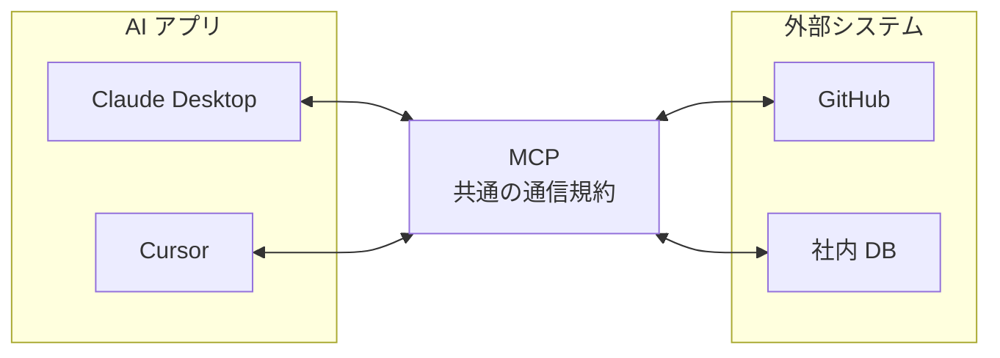
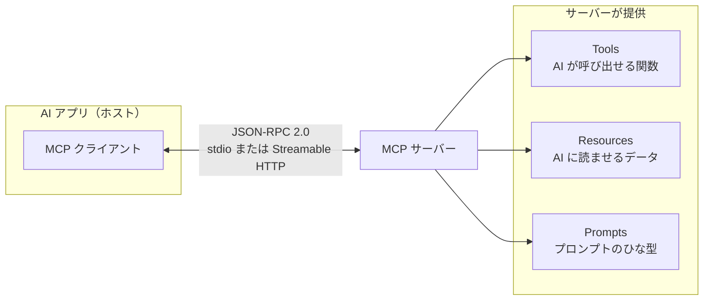
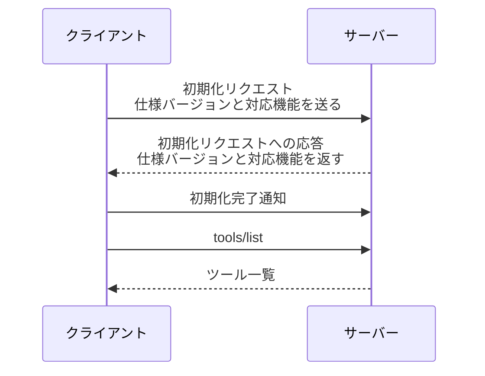
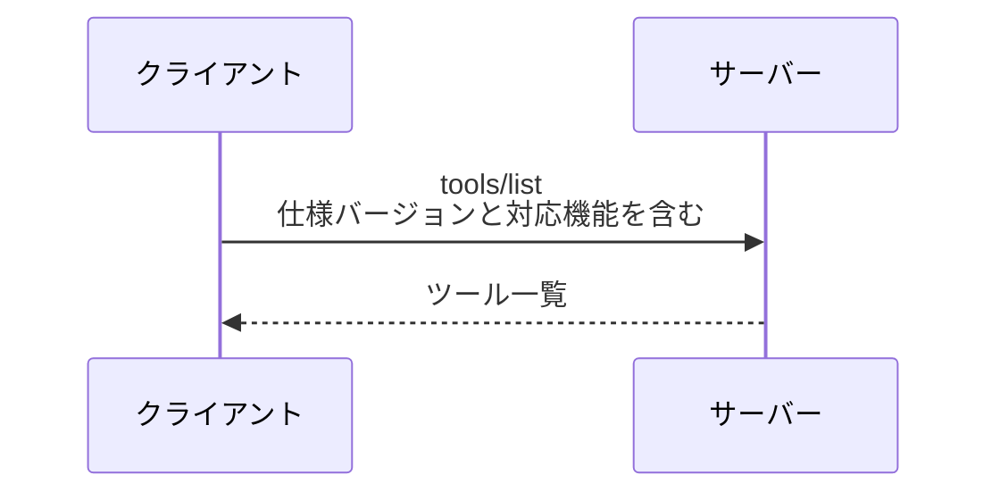
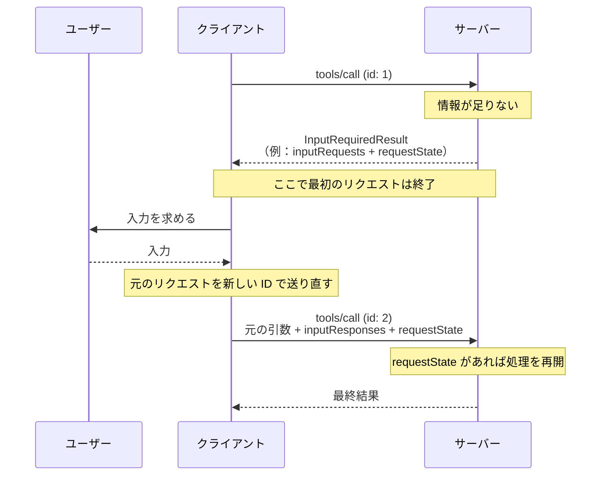
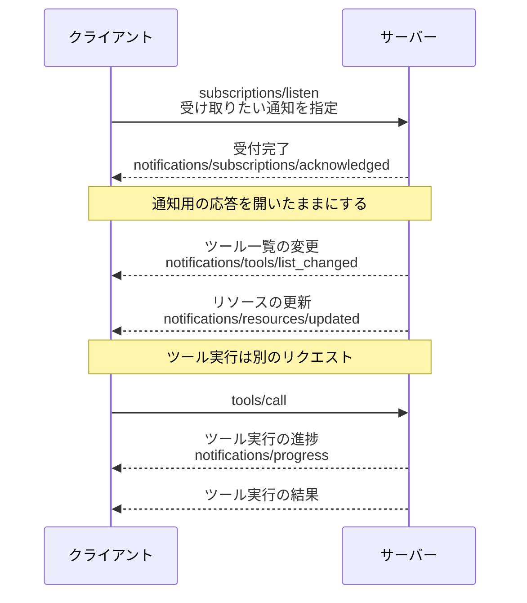

## はじめに

2026 年 7 月 28 日に、MCP（Model Context Protocol）の新仕様 [`2026-07-28`](https://modelcontextprotocol.io/specification/2026-07-28/) が公開されました。

この記事では、MCP を初めて知る人に向けて、MCP の基本的な仕組みを説明します。そのうえで、旧仕様にどのような課題があり、新仕様でどう変わったのかを見ていきます。

今回の大きな変更は、**MCP の中核がステートフルな方式からステートレスな方式へ変わったこと**です。

旧仕様では、初回のやり取りで、どの MCP 仕様に従うかと、クライアントとサーバーがそれぞれ対応できる機能を確認していました。初回以降のリクエストは、この確認結果を前提にしていました。新仕様では、クライアントが各リクエストに、どの MCP 仕様に従うかと、そのリクエストに関係するクライアント側の対応機能を含めます。

## 1. そもそも MCP とは何か

MCP は、**AI アプリと外部システムが、決まった形式でメッセージを送受信するためのオープンな通信規約**です。

MCP という言葉を初めて聞いた方や、まず全体像をつかみたい方には、ゆるコンピュータ科学ラジオの[「最新技術 MCP の正体は、『すごい説明書』でした。」](https://www.youtube.com/watch?v=RTMH7X8BNvg)がおすすめです。筆者もこの動画で、MCP がどのような仕組みなのかを理解できました。

たとえば、Claude Desktop や Cursor のような AI アプリに、GitHub の Issue を読ませたり、社内のデータベースを検索させたりするとします。共通の決まりがなければ、AI アプリと外部システムの組み合わせごとに接続処理を実装しなければなりません。

そこで、AI アプリと外部システムの間で、メッセージを送受信する方法を共通化したのが MCP です。

MCP を中心に置くと、AI アプリと外部システムの関係は次のように整理できます。

MCP には、次の 3 つの役割があります。

| 役割 | 内容 |
|---|---|
| **ホスト** | ユーザーが操作する AI アプリ。複数のクライアントを管理する |
| **クライアント** | ホストの中で、特定の MCP サーバーとの通信を担当する部分 |
| **サーバー** | データや機能を提供する側。GitHub 連携や DB 検索など |

この記事では説明を短くするため、ホストとクライアントをまとめて「クライアント」と呼びます。

クライアントからサーバーへの 1 回の処理依頼を**リクエスト**、サーバーが返す結果を**応答**と呼びます。この記事でいう**通信**は、リクエストや応答、通知を含む送受信全体のことです。

サーバーがクライアントに提供するものは、大きく 3 種類あります。

- **Tools（ツール）** — AI が呼び出せる関数。`create_issue` や `search_db` など
- **Resources（リソース）** — AI に読ませるデータ。ファイルや設定など
- **Prompts（プロンプト）** — 繰り返し使えるプロンプトのひな型

MCP のメッセージには [JSON-RPC 2.0](https://www.jsonrpc.org/specification) を使います。クライアントとサーバーは、「`tools/list` でツール一覧を取得する」「`tools/call` でツールを実行する」といったメッセージを JSON で送受信します。

標準の通信経路（トランスポート）は 2 つです。MCP サーバーの動かし方と、メッセージを送る方法が異なります。

| 通信経路 | MCP サーバーの動かし方 | メッセージの送り方 |
|---|---|---|
| **stdio** | クライアントが子プロセスとして起動する | サーバーの標準入力と標準出力を使う |
| **Streamable HTTP** | クライアントとは独立して動かす | サーバーの URL へ HTTP POST で送る |

stdio は同じコンピューター内での通信に使います。Streamable HTTP は、ネットワーク上のサーバーとも通信できます。

ここまで説明した役割と、サーバーが提供するものの関係は次のとおりです。

[MCP の仕様バージョン](https://modelcontextprotocol.io/docs/learn/versioning)（protocol version）は、`YYYY-MM-DD` 形式です。クライアントとサーバーは、この値を使って、どの時点のルールに従うかを伝えます。

MCP 仕様では、クライアントやサーバーがどの MCP 機能に対応しているかを `capabilities` で示します。この記事では「対応機能」と表記します。たとえば、クライアント側はサーバーが求めた追加情報をユーザーから受け取れるか、サーバー側はツールやリソースを提供できるかを示します。

## 2. 新仕様で通信の始め方がどう変わったのか

ステートフルな旧仕様では、初回のハンドシェイクで、使う仕様バージョンと、クライアントとサーバーがそれぞれ対応する機能を確認していました。以降のリクエストは、その確認結果を前提に処理していました。

ステートレスな新仕様では、クライアントがすべてのリクエストに、仕様バージョンと、その処理に関係するクライアント側の対応機能を含めます。サーバーは通常の応答ごとに自分の対応機能を返しません。クライアントは必要に応じて、後述する `server/discover` でサーバー側の対応機能を確認します。

### 2-1. 旧仕様：初期化してから処理を始める

[`2025-11-25` の旧仕様](https://modelcontextprotocol.io/specification/2025-11-25/basic/lifecycle)では、ツールを利用する前に、クライアントが初期化リクエストを送り、ハンドシェイクを始めていました。

初期化リクエストで、クライアントは「どの仕様バージョンを使いたいか」と「MCP のどの機能に対応しているか」を伝えます。サーバーは、実際に使う仕様バージョンと、サーバーが対応している機能を返します。

サーバーから応答を受け取ったクライアントは、初期化の完了を通知します。その後、ツール一覧の取得やツールの実行に進めます。

旧仕様の流れは、次のとおりです。

### 2-2. 新仕様：各リクエストに必要な情報を含める

新仕様では、初期化のハンドシェイクを廃止しました。クライアントは、ツール一覧の取得やツールの実行を最初からリクエストできます。

その代わり、すべてのリクエストに「そのリクエストで使う仕様バージョン」と「その処理に関係するクライアントの対応機能」を含めます。新仕様の流れは、次のとおりです。

仕様バージョンと対応機能は、リクエストの `params._meta` に入れます。サーバーは、過去のやり取りではなく、今届いたリクエストを見て、どのルールと機能を使うか判断します。

### 2-3. なぜステートレスな方式へ変えたのか

ステートレスへ変えた主な理由は、サーバーを増やしやすくし、障害時の影響とセッション管理の手間を減らすためです。[公式発表](https://blog.modelcontextprotocol.io/posts/2026-07-28/#no-handshake-or-sessions)では、信頼性と拡張性を高めたい開発者から強く求められていた変更だと説明されています。

旧仕様では、ハンドシェイクで確認した内容を、その後のリクエストでも使い続けていました。HTTP では、サーバーが `Mcp-Session-Id` を発行し、複数のリクエストを同じセッションとして扱うこともできました。[ステートレス化を提案した SEP-2575](https://github.com/modelcontextprotocol/modelcontextprotocol/pull/2575) は、この方式に次の課題があったと説明しています。

- **サーバーを増やしにくい**：同じセッションのリクエストを同じサーバーへ送り続けるか、セッション情報を共有する保存場所が必要になる
- **障害の影響を受けやすい**：セッション情報をそのサーバーだけに保存していると、サーバーの停止時に後続のリクエストで使う情報を失う
- **実装が複雑になる**：クライアントとサーバーの両方で、セッションの開始から終了までを管理する必要がある

共有ストレージを用意すれば、旧仕様でも複数台のサーバーで処理できました。ただし、セッション情報の保存や取得、有効期限を管理し、共有ストレージの障害にも備える必要があります。

[新仕様](https://modelcontextprotocol.io/specification/2026-07-28/basic/index#statelessness)では、各リクエストに仕様バージョンと対応機能が入っています。サーバーは過去の通信に頼らず、届いたリクエストだけで処理に使うルールと機能を判断できます。初期化で確認した情報を共有するためだけのストレージは不要です。そのため、リクエストを複数台のサーバーへ振り分けやすくなります。

### 2-4. 検索の続きや長時間処理は引き継げる

ステートレスになったのは、MCP の通信を管理する部分です。`Mcp-Session-Id` を使うプロトコル上のセッションは廃止されましたが、アプリケーションが検索条件や処理の進捗を保存することは禁止されていません。

検索条件をサーバー側に保存する実装を例にすると、新旧の処理は次のように変わります。ここでいう検索 ID は説明用の例であり、MCP 仕様で定められた共通フィールドではありません。

| 方式 | 最初のリクエスト | 次のリクエスト |
|---|---|---|
| **旧仕様（HTTP）** | サーバーが検索条件をセッションと結び付けて保存する | セッション ID から検索条件を特定し、続きを処理する |
| **新仕様** | サーバーが検索 ID を返す | クライアントが検索 ID を送り、サーバーが検索条件を特定して続きを処理する |

新仕様でも、サーバーは検索条件や進捗をデータベースなどに保存できます。クライアントが次のリクエストで検索 ID を送ると、サーバーはその ID から続きを特定します。検索 ID が示す情報をどのサーバーからも参照できれば、最初とは別のサーバーでも続きを処理できます。最初のサーバーのメモリだけに保存した場合、別のサーバーでは続きの情報を取得できません。

なお、ステートレスになっても、stdio や HTTP の接続自体は残ります。サーバーは、同じ接続から届いたことではなく、リクエスト内の検索 ID から続きの処理を特定します。

## 3. `2026-07-28` の主な変更点

ハンドシェイクとセッションの廃止に伴い、リクエストに含める情報、応答の種類、通知の受け取り方が変わりました。非推奨になった機能も含め、主な変更を順に説明します。

### 3-1. 各リクエストに仕様バージョンなどの情報を含める

各リクエストの `params._meta` には、次のキーを使います。

| キー | 仕様上の扱い | 中身 |
|---|---|---|
| `io.modelcontextprotocol/protocolVersion` | 必須 | このリクエストが使う仕様バージョン |
| `io.modelcontextprotocol/clientCapabilities` | 必須 | このリクエストに関係するクライアントの対応機能 |
| `io.modelcontextprotocol/clientInfo` | 推奨（設定により省略可） | クライアント名とソフトウェアのバージョン |
| `io.modelcontextprotocol/logLevel` | 任意 | このリクエストで出してほしいログの最低レベル |

必須フィールドが欠けていれば、サーバーはそのリクエストを拒否する必要があります。JSON-RPC のエラーコードは `-32602`（`Invalid params`）です。Streamable HTTP では、HTTP ステータスに `400 Bad Request` を使う必要があります。

サーバーは、結果の `_meta` に `io.modelcontextprotocol/serverInfo` を追加することが推奨されています。このフィールドには、サーバー名とソフトウェアのバージョンを入れます。

### 3-2. `server/discover` でサーバーの対応状況を確認する

[`server/discover`](https://modelcontextprotocol.io/specification/2026-07-28/server/discover) の目的は、クライアントがサーバーの対応状況を 1 回のリクエストで確認できるようにすることです。サーバーが対応する仕様バージョンと、ツール、リソース、プロンプトなどへの対応状況をまとめて取得できます。

クライアントが `server/discover` を送るかどうかは任意です。サーバーの対応状況を、ほかのリクエストより先に確認できます。確認せず、最初から `tools/call` などを送ることもできます。

`server/discover` はリクエストごとに送る必要はありません。応答にはキャッシュの判断に使う情報が含まれ、クライアントは取得済みの対応状況を再利用できます。

指定した仕様バージョンにサーバーが対応していない場合は、`UnsupportedProtocolVersionError`（`-32022`）が返ります。サーバーはこのエラーとともに、対応している仕様バージョンの一覧を返します。クライアントは一覧から自身も対応しているバージョンを選び、リクエストを送り直すことが推奨されています。

ただし、新旧両方に対応する stdio クライアントには、`server/discover` を最初に送ることが推奨されています。その応答から、サーバーが新仕様に対応しているかを判定します。

サーバーは `server/discover` を実装する必要があります。応答には、対応する仕様バージョンと対応機能を含めます。サーバー情報には、前節で説明した `io.modelcontextprotocol/serverInfo` を追加することが推奨されています。

### 3-3. 追加情報は「応答して送り直す」方式になった（MRTR）

新仕様では、サーバーが追加情報を必要とする場合、途中結果を返します。この途中結果を `InputRequiredResult` と呼びます。クライアントは必要な情報を集め、元のリクエストを送り直します。この流れが [Multi Round-Trip Requests](https://modelcontextprotocol.io/specification/2026-07-28/basic/patterns/mrtr)（MRTR、複数回の往復）です。

たとえば、サーバーがファイルを削除する前に、ユーザーへ確認したい場合があります。旧仕様では、サーバーからクライアントへ次のような別のリクエストを送り、追加情報を求めていました。

- `elicitation/create` — ユーザーに追加入力を求める（例：「GitHub のユーザー名を入力してください」）
- `sampling/createMessage` — クライアント側の LLM に回答を作らせる
- `roots/list` — クライアントの作業ディレクトリ一覧を取得する

新仕様では、これらをサーバーからクライアントへの別の JSON-RPC リクエストとして送れません。次の図は、`InputRequiredResult` を受け取ったクライアントが、元のリクエストを送り直すまでの流れを示しています。

MRTR で使う主なフィールドは、次の 3 つです。

| フィールド | 役割 |
|---|---|
| `inputRequests` | サーバーが応答に含める追加情報の依頼。省略可能 |
| `inputResponses` | クライアントが送り直すときに含める、`inputRequests` への回答 |
| `requestState` | サーバーだけが中身を解釈する文字列。省略可能 |

`InputRequiredResult` には、`inputRequests` と `requestState` の少なくとも一方が必要です。クライアントは `requestState` の中身を解釈せず、リクエストを送り直すときに同じ値を返します。

最初のリクエストと送り直したリクエストは、別々のリクエストとして扱われます。最初に応答したサーバーのメモリだけに途中経過を残すと、別のサーバーが送り直したリクエストを受け取ったときに処理を再開できません。

サーバーは、再開に必要な情報を `requestState` 自体に含めるか、`requestState` を手がかりに共有ストレージから取得します。これにより、最初に応答したサーバーとは別のサーバーでも、送り直したリクエストを処理できます。

基本仕様で MRTR を使えるのは `tools/call`、`resources/read`、`prompts/get` の 3 つだけです。サーバーは、それ以外のリクエストで `input_required` を返してはいけません。

### 3-4. 応答の種類を `resultType` で示す

JSON-RPC の応答には、処理結果を入れる `result` と、エラーの内容を入れる `error` があります。新仕様では、`result` が最終結果とは限らず、追加情報を待つ途中結果の場合もあります。

そこで、サーバーは返す内容の種類を `result` 内の `resultType` で必ず示します。クライアントはこの値を見て、結果を受け取って処理を終えるか、必要な情報を集めてリクエストを送り直すかを判断します。

基本仕様で使う値は、次の 2 つです。

| 値 | 何を示すか | クライアントの対応 |
|---|---|---|
| `"complete"` | 処理が完了し、最終結果が返った | 結果を受け取って処理を終える |
| `"input_required"` | 処理に追加情報が必要 | 必要な情報を集め、元のリクエストを送り直す |

MCP には、基本仕様へ任意の機能を追加する `extension` もあります。この記事では「拡張」と表記します。拡張は `resultType` に別の値を追加できます。

長時間処理を扱う [Tasks 拡張](https://modelcontextprotocol.io/extensions/tasks/overview)では、`resultType` に `"task"` を使います。`"complete"` や `"input_required"` と同時に使うのではなく、結果に合う値を一つだけ入れます。`"task"` は、サーバーがリクエストを長時間処理として受け付け、`taskId` を含むタスク情報を返したことを示します。

サーバーが `"task"` を返せるのは、クライアントとサーバーの両方が Tasks 拡張への対応を示した場合だけです。

旧仕様で実験的にコア仕様へ入っていた Tasks は、拡張へ移りました。メッセージの流れも変わったため、新旧の Tasks に互換性はありません。

旧仕様には `resultType` がありません。そのため、クライアントが旧仕様のサーバーから `resultType` のない結果を受け取った場合は、処理の完了を示す `"complete"` として扱う必要があります。

### 3-5. 通知は `subscriptions/listen` で受け取る

ここで扱う通知は、ツール一覧の変更やリソースの更新をサーバーからクライアントへ知らせるメッセージです。クライアントは、変更が起きたか何度も問い合わせる必要がありません。

旧仕様では、クライアントが HTTP GET リクエストを送り、その応答を開いたままにして通知を受け取っていました。特定のリソースの更新には、`resources/subscribe` と `resources/unsubscribe` も使っていました。新仕様では、これらを廃止し、変更通知の受け取り方を [`subscriptions/listen`](https://modelcontextprotocol.io/specification/2026-07-28/basic/patterns/subscriptions) にまとめました。

Streamable HTTP では、クライアントが `subscriptions/listen` という POST リクエストを送り、受け取りたい通知の種類を指定します。サーバーは最初に `notifications/subscriptions/acknowledged` を送り、受け付けた通知の種類を伝えます。

サーバーは HTTP の応答を閉じず、ツール一覧やリソースが変わるたびに、同じ応答を通じて通知を順に送ります。この送信方法が SSE です。

サーバーは、各通知の `io.modelcontextprotocol/subscriptionId` に、対応する `subscriptions/listen` のリクエスト ID を入れます。クライアントはこの ID から、どの `subscriptions/listen` に属する通知かを判別できます。

ただし、すべての通知が `subscriptions/listen` に届くわけではありません。ツール実行の進捗など、特定のリクエストだけに関係する通知は、そのリクエストの応答と同じ経路で受け取ります。次の図は、変更通知と進捗通知の経路の違いを示しています。

`subscriptions/listen` の応答は長時間開いたままになりますが、セッションではありません。接続が切れた場合は途中から再開せず、新しいリクエスト ID で `subscriptions/listen` を送り直します。

### 3-6. Roots・Sampling・Logging が非推奨になった

Roots、Sampling、Logging は非推奨になりました。非推奨の期間中も利用できますが、新しい実装では使わないことが推奨されています。

次の表は、公式が示している移行方法をまとめたものです。元の機能をそのまま置き換えるものではありません。

| 機能 | 何だったか | 移行時の選択肢 |
|---|---|---|
| **Roots** | クライアントの作業ディレクトリをサーバーに知らせる | ツール引数、リソース URI、サーバー設定で渡す |
| **Sampling** | サーバーがクライアント側の LLM に回答を作らせる | LLM 提供元の API を直接利用する |
| **Logging** | MCP の通知としてログを送る | stdio では `stderr`、ログや処理の流れを記録する場合は標準技術の OpenTelemetry を使う |

次の仕組みも非推奨です。

- **HTTP+SSE トランスポート**（`2025-03-26` から非推奨）
- 認可サーバーへクライアントを自動登録する **Dynamic Client Registration（RFC 7591）**

Dynamic Client Registration の代わりに、新しい実装では [Client ID Metadata Documents](https://modelcontextprotocol.io/specification/2026-07-28/basic/authorization/client-registration#client-id-metadata-documents) の利用が推奨されています。対応していない認可サーバーとの互換性を保つ場合は、Dynamic Client Registration を引き続き使えます。

移行時期は機能によって異なります。公式の[非推奨機能の一覧](https://modelcontextprotocol.io/specification/2026-07-28/deprecated)を確認してください。

### 3-7. API・エラーコード・JSON Schema の変更

ここまで取り上げていない変更のうち、既存実装に影響するものをまとめます。

| 変更 | 内容 |
|---|---|
| API の廃止 | `ping`、`logging/setLevel`、`notifications/roots/list_changed`、`notifications/elicitation/complete` を廃止した。URL モードの Elicitation から `elicitationId` も削除した |
| エラーコード | `-32020`〜`-32099` を MCP 仕様専用に整理した。リソースが見つからない場合のコードは `-32002` から `-32602` へ変更した。旧サーバーから届く `-32002` は引き続き受け入れることが推奨される |
| JSON Schema | ツールの `inputSchema` と `outputSchema` で JSON Schema 2020-12 のキーワードを使えるようにした。`structuredContent` はオブジェクト以外の JSON 値も扱える |

## 4. MCP の利用者は何をすればいいのか

Claude Code や Cursor で MCP サーバーを利用するだけなら、利用者が MCP プロトコルを実装する必要はありません。新仕様への対応は、これらの AI アプリや MCP サーバーの提供元が行います。利用者は、互換性や移行案内をそれぞれの提供元の公式情報で確認し、必要に応じて更新や設定変更を行います。

### 4-1. 新旧の組み合わせによっては動かない

互換性は、クライアントとサーバーが対応する方式で決まります。MCP の[公式な互換性表](https://modelcontextprotocol.io/specification/2026-07-28/basic/versioning#compatibility-matrix)では、`2026-07-28` 以降を新方式、`2025-11-25` 以前を旧方式としています。

次の組み合わせには互換性がありません。

| クライアント | サーバー |
|---|---|
| 新方式のみ | 旧方式のみ |
| 旧方式のみ | 新方式のみ |

どちらかが新旧の両方に対応していれば、相手に合わせて方式を切り替えられます。実際の対応範囲は、利用中の AI アプリと MCP サーバーの公式情報で確認してください。

新方式だけの相手と組み合わせる場合は、旧方式だけに対応するクライアントまたはサーバーを更新するか、互換性のあるものへ置き換える必要があります。

### 4-2. 非推奨機能を使うサーバーは将来変わる可能性がある

Sampling、Roots、Logging を使うサーバーは、非推奨機能からの移行時に設定や動作を変更する場合があります。ただし、これらの機能は `2026-07-28` でも削除されていません。

利用中のサーバーから移行案内が出ていないか確認してください。

## 5. MCP サーバーを公開する側は何をすればいいのか

旧仕様のサーバーを新仕様へ移行するときは、次の順に実装を見直します。MCP を設定して使うだけであれば、「[6. まとめ](#6-まとめ)」へ進んでください。

### 5-1. SDK と起動方法を更新する

まず、利用中の言語のリリースノートや移行ガイドを確認し、対応版へ更新します。[2026 年 7 月 28 日の公式発表](https://blog.modelcontextprotocol.io/posts/2026-07-28/#sdks)時点では、TypeScript、Python、Go、C# 向け SDK が `2026-07-28` に対応済みです。Rust SDK は正式版前のベータ版で対応しています。

以下は TypeScript SDK を移行する場合の要点です。v2 には Node.js 20 以上が必要です。従来の `@modelcontextprotocol/sdk` は、サーバー用の `@modelcontextprotocol/server` やクライアント用の `@modelcontextprotocol/client` などに分かれました。

v1 から移行する場合は、パッケージのルートで `npx @modelcontextprotocol/codemod@latest v1-to-v2 .` を実行できます。変換後は[公式の移行ガイド](https://ts.sdk.modelcontextprotocol.io/v2/migration/upgrade-to-v2)に沿って `@mcp-codemod-error` を検索し、型チェックとテストを行います。

TypeScript SDK v2 で [`2026-07-28` を使うには、明示的な設定が必要です](https://ts.sdk.modelcontextprotocol.io/v2/migration/support-2026-07-28)。

クライアントは `versionNegotiation` を設定します。HTTP サーバーでは、`createMcpHandler` で MCP リクエストを処理するハンドラーを作ります。stdio サーバーでは、`serveStdio` で標準入出力を使った通信を開始します。

### 5-2. セッションに保存していた情報を分ける

旧実装でセッションに保存していた情報は、プロトコルの情報と、処理を続けるための情報に分けて移行します。

- **プロトコルの情報**：仕様バージョン、クライアントの対応機能、クライアント名など。新仕様では、サーバーがリクエストごとの `_meta` から取得する。クライアント名とソフトウェアのバージョンを含めることは推奨だが、設定により省略できる
- **処理を続けるための情報**：検索の続きや長時間処理の進捗など。次のリクエストに ID などを含め、続ける処理をサーバーが特定できるようにする

検索や長時間処理の情報を次のリクエストへ引き継ぐ方法は、用途に応じて選びます。

- 複数のツール呼び出しで情報を共有するなら、サーバーが ID を発行し、クライアントが次のツール引数にその ID を含める
- MRTR でリクエストを送り直すために必要な情報なら、`requestState` 自体に含めるか、`requestState` から共有ストレージを参照できるようにする
- 長時間かかる処理なら、Tasks 拡張の `taskId` を使う

どの方法を選んでも、サーバーはリクエストに含まれる情報から、続ける処理を特定できるようにします。同じ接続から届いたという理由だけで、前回と同じ処理だと判断してはいけません。

### 5-3. `server/discover` と応答の共通フィールドに対応する

サーバーは `server/discover` を必ず実装し、サーバーが対応している仕様バージョンと対応機能を応答に含めます。サーバー名とソフトウェアのバージョンを含めることは推奨で、使い方の説明は任意です。

サーバーが `result` を返すときは、その中に `resultType` を必ず入れます。`server/discover` と、次のメソッドが返す `"complete"` の結果には、キャッシュの判断に使う `ttlMs` と `cacheScope` も必要です。

- `tools/list`
- `prompts/list`
- `resources/list`
- `resources/templates/list`
- `resources/read`

`resultType` が `"input_required"` の途中結果と、MRTR で送り直したリクエストの結果はキャッシュしてはいけません。`ttlMs` は、結果を再取得せずに使える時間の目安です。`cacheScope` は、誰に返しても同じ結果なら `"public"`、同じ認可情報の範囲だけで再利用できるなら `"private"` にします。

### 5-4. サーバーから送っていたリクエストを MRTR に置き換える

旧仕様でサーバーから `elicitation/create`、`sampling/createMessage`、`roots/list` を送っていた箇所は、`InputRequiredResult` を返す形へ変更します。`requestState` が権限や処理内容に影響する場合は、改ざんを検知できる HMAC や AEAD などで保護しなければなりません。

### 5-5. 変更通知を `subscriptions/listen` に移す

ツール一覧の変更やリソースの更新など、変更通知は `subscriptions/listen` に移します。サーバーは最初に `notifications/subscriptions/acknowledged` を送り、その `subscriptions/listen` に属する通知へ `io.modelcontextprotocol/subscriptionId` を含めます。

### 5-6. HTTP ヘッダーを検証する

[Streamable HTTP](https://modelcontextprotocol.io/specification/2026-07-28/basic/transports/streamable-http#standard-request-headers) のクライアントは、すべての POST リクエストに `MCP-Protocol-Version` ヘッダーを付ける必要があります。JSON-RPC リクエストには、`Mcp-Method` も必要です。

仕様バージョンやメソッド名をリクエスト本文とヘッダーの両方に入れると、ロードバランサーやゲートウェイは、JSON 本文を解析せずにリクエストの振り分け先や適用する制限を判断できます。

`tools/call`、`resources/read`、`prompts/get` では、ツール名、リソース URI、またはプロンプト名を入れた `Mcp-Name` も必要です。

サーバーは、ツール引数の定義に `x-mcp-header` を付け、その引数を `Mcp-Param-*` ヘッダーにも入れるよう指定できます。この指定は任意ですが、Streamable HTTP クライアントは指定されたヘッダーの送信に対応する必要があります。

リクエスト本文を処理するサーバーは、ヘッダーと本文の値が一致するか検証する必要があります。`2026-07-28` のリクエストで必須ヘッダーがない場合や値が一致しない場合は、`400 Bad Request` と `HeaderMismatch`（`-32020`）を返します。

### 5-7. 認可を見直す

OAuth による認可を自前で実装している場合は、クライアントの登録方法と、認可応答が正しい認可サーバーから届いたかを確認する処理を見直します。[Dynamic Client Registration](https://modelcontextprotocol.io/specification/2026-07-28/basic/authorization/client-registration#dynamic-client-registration) は非推奨です。

認可サーバーへクライアント情報を事前登録していれば、クライアントはその登録情報を使います。事前登録がなく、認可サーバーが対応していれば、[Client ID Metadata Documents](https://modelcontextprotocol.io/specification/2026-07-28/basic/authorization/client-registration#client-id-metadata-documents) の利用が推奨されています。この方法では、クライアントは自身の名前や認可後に戻る URL などの登録情報を JSON 形式で公開します。認可サーバーは、公開先の HTTPS URL をクライアント ID として扱い、その URL から登録情報を取得します。

Dynamic Client Registration は、認可サーバーが Client ID Metadata Documents に対応していない場合の互換手段です。引き続き使うクライアントは、クライアントの種類に合う `application_type` を登録情報へ含める必要があります。

事前登録または Dynamic Client Registration で発行されたクライアント ID などは、発行元の認可サーバーごとに保存する必要があります。別の認可サーバーでは使い回してはいけません。

認可サーバーには、認可応答に `iss` を含めることが推奨されています。`iss` は、その応答を返した認可サーバーを識別する値です。クライアントは認可コードを使う前に、応答内の `iss` が事前に記録した認可サーバーの識別子と一致するか検証する必要があります。これにより、別の認可サーバーから届いた応答を誤って使うのを防ぎます。

認可サーバーのメタデータが、認可応答に `iss` を含めると示しているのに、実際の応答に `iss` がなければ、クライアントはその応答を拒否する必要があります。

## 6. まとめ

`2026-07-28` の中心は、ハンドシェイクとプロトコル上のセッションを廃止し、各リクエストに必要な情報を含めるステートレスな方式へ変えたことです。

- **MCP の利用者**：利用中の AI アプリと MCP サーバーに互換性があるか確認し、必要なら更新する
- **サーバーを公開する側**：初期化リクエストやセッション ID に頼る実装を見直し、SDK の移行ガイドに沿ってリクエストごとの情報を処理できるようにする

検索の続きや長時間処理の進捗を引き継ぐ場合は、ID、`requestState`、`taskId` などを次のリクエストに含め、続ける処理を特定します。

## 参考

- [Specification 2026-07-28](https://modelcontextprotocol.io/specification/2026-07-28/) — 公式仕様
- [Lifecycle 2025-11-25](https://modelcontextprotocol.io/specification/2025-11-25/basic/lifecycle) — 旧仕様のハンドシェイク、仕様バージョンの選択、対応機能の確認
- [Key Changes](https://modelcontextprotocol.io/specification/2026-07-28/changelog) — 変更点一覧
- [The 2026-07-28 Specification](https://blog.modelcontextprotocol.io/posts/2026-07-28/) — 公式アナウンス
- [Versioning and Compatibility](https://modelcontextprotocol.io/specification/2026-07-28/basic/versioning) — 新旧仕様の互換性とバージョン選択
- [Streamable HTTP](https://modelcontextprotocol.io/specification/2026-07-28/basic/transports/streamable-http) — HTTP ヘッダー、SSE、新旧方式の判定
- [Multi Round-Trip Requests](https://modelcontextprotocol.io/specification/2026-07-28/basic/patterns/mrtr) — MRTR の詳細
- [SEP-2575: Make MCP Stateless](https://github.com/modelcontextprotocol/modelcontextprotocol/pull/2575) — ステートレス化の目的と設計
- [SEP-2567: Sessionless MCP via Explicit State Handles](https://github.com/modelcontextprotocol/modelcontextprotocol/pull/2567) — セッションを使わずに処理を引き継ぐ設計
- [Subscriptions](https://modelcontextprotocol.io/specification/2026-07-28/basic/patterns/subscriptions) — subscriptions/listen の詳細
- [Caching](https://modelcontextprotocol.io/specification/2026-07-28/server/utilities/caching) — ttlMs と cacheScope の要件
- [Deprecated Features](https://modelcontextprotocol.io/specification/2026-07-28/deprecated) — 非推奨機能のレジストリ
- [Tasks](https://modelcontextprotocol.io/extensions/tasks/overview) — Tasks 拡張の現行仕様と利用方法
- [Authorization](https://modelcontextprotocol.io/specification/2026-07-28/basic/authorization) — 認可と発行元検証
- [Upgrading from v1.x to v2](https://ts.sdk.modelcontextprotocol.io/v2/migration/upgrade-to-v2) — TypeScript SDK v2 への移行ガイド
- [Supporting protocol revision 2026-07-28](https://ts.sdk.modelcontextprotocol.io/v2/migration/support-2026-07-28) — TypeScript SDK v2 で新仕様を使うための設定
- [最新技術 MCP の正体は、「すごい説明書」でした。](https://www.youtube.com/watch?v=RTMH7X8BNvg) — ゆるコンピュータ科学ラジオによる MCP の解説動画
