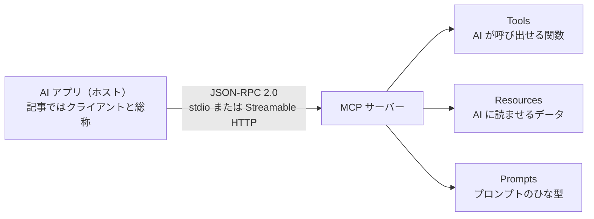
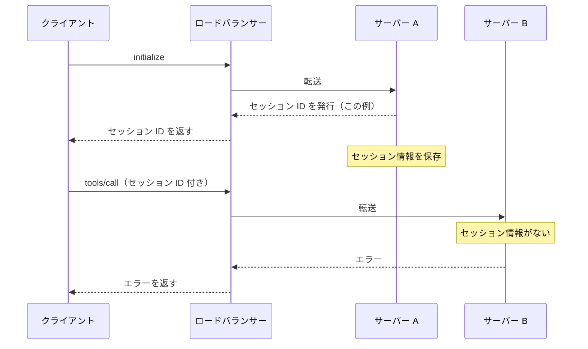
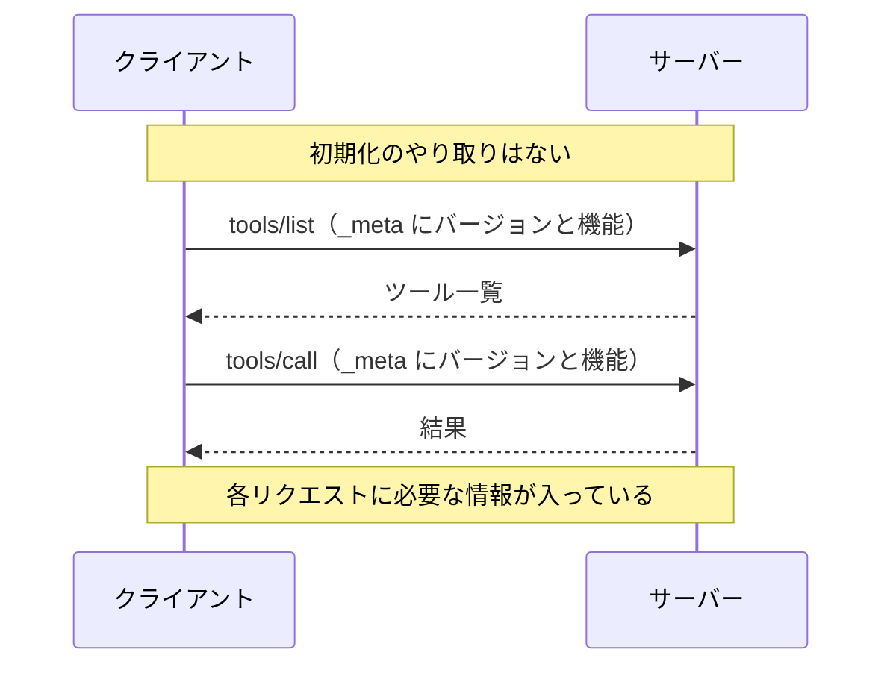
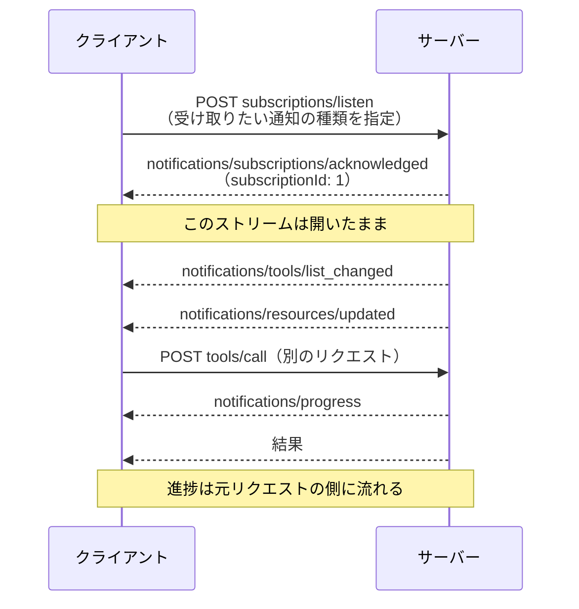

## はじめに

2026 年 7 月 28 日に、MCP（Model Context Protocol）の新しい仕様 [`2026-07-28`](https://modelcontextprotocol.io/specification/2026-07-28/) が公開されました。

今回の中心的な変更は、通信を始めるときの初期化と、MCP プロトコル上のセッションを廃止したことです。セッションとは、複数回の通信を一つのまとまりとして扱う仕組みです。

これまでは、最初の通信で確認したバージョンや機能を、その後の通信でも使っていました。新しい仕様では、クライアントからサーバーへ送る処理依頼ごとに、バージョンとクライアントの機能を含めます。

ただし、検索の続きや長時間処理など、アプリの処理状況まで保存できなくなったわけではありません。複数の処理依頼にまたがる情報は、クライアントが明示的な ID を送ることで引き継ぎます。

この記事では、MCP の基本から新仕様の変更点まで順に説明します。

先に影響をまとめると、次のとおりです。

- **MCP を使う側**：利用中のクライアントとサーバーが新しい仕様に対応しているか確認する
- **MCP サーバーを公開する側**：初期化やプロトコル上のセッションに頼る実装を、必要な情報をリクエストごとに受け取る方式へ変更する

## 1. そもそも MCP とは何か

MCP は、**AI アプリと外部のデータや機能を共通の手順でつなぐためのオープンな通信規約**です。

たとえば Claude Desktop や Cursor のような AI アプリに「GitHub の Issue を読ませたい」「社内のデータベース（DB）を検索させたい」とします。AI アプリごとに別の接続方法を作ると、連携先が増えるたびに実装も増えます。そこで「つなぎ方」を共通化したのが MCP です。さまざまな機器を同じ USB-C コネクターでつなげるのと似ています。

厳密には、MCP には次の 3 つの役割があります。

| 役割 | 内容 |
|---|---|
| **ホスト** | ユーザーが操作する AI アプリ。複数のクライアントを管理する |
| **クライアント** | ホストの中で、特定の MCP サーバーとの通信を担当する部分 |
| **サーバー** | データや機能を提供する側。GitHub 連携や DB 検索など |

この記事では説明を短くするため、ホストとクライアントをまとめて「クライアント」と呼びます。

サーバーがクライアントに提供するものは、大きく 3 種類あります。

- **Tools（ツール）** — AI が呼び出せる関数。`create_issue` や `search_db` など
- **Resources（リソース）** — AI に読ませるデータ。ファイルや設定など
- **Prompts（プロンプト）** — 繰り返し使えるプロンプトのひな型

通信の中身は [JSON-RPC 2.0](https://www.jsonrpc.org/specification) です。「`tools/list` でツール一覧を取得する」「`tools/call` でツールを実行する」といったメッセージを JSON でやり取りします。

クライアントからサーバーへの処理依頼を「リクエスト」と呼びます。サーバーからクライアントへ返す結果が「レスポンス」です。

標準の通信経路（トランスポート）は 2 つです。

- **stdio** — サーバーを手元のコンピューターでプログラムとして起動し、そのプログラムの入力と出力を使ってやり取りする
- **Streamable HTTP** — Web で広く使われる HTTP という通信方法でやり取りする。離れた場所にあるサーバーとの通信によく使われる



[MCP の仕様バージョン](https://modelcontextprotocol.io/docs/2026-07-28/learn/versioning)は、`YYYY-MM-DD` 形式です。この日付は、互換性を壊す変更が最後に行われた日を示します。

## 2. 初期化とセッションが廃止された理由

以前の仕様では、クライアントとサーバーが最初に `initialize` をやり取りして、互いのバージョンと機能を確認していました。以降のリクエストは、その確認が済んでいることを前提に送られます。このように、前の通信で決めた情報を次の通信でも使う方式を**ステートフル**と呼びます。

HTTP では、サーバーが `Mcp-Session-Id` ヘッダーを発行し、セッションを管理することもできました。セッション情報を各サーバーの中だけに保存する構成では、複数台のサーバーに処理を分けにくくなります。

次の図は、ロードバランサーがリクエストを 2 台のサーバーへ振り分ける例です。ロードバランサーとは、届いたリクエストを複数のサーバーへ分配する仕組みです。



サーバー B には、このセッションの情報がありません。セッション情報を保存したのはサーバー A だからです。

この問題を避けるには、セッション情報を共有ストレージに置く方法があります。共有ストレージとは、複数のサーバーから読み書きできる保存場所です。ほかにも、同じクライアントのリクエストを毎回同じサーバーへ送る方法があります。

共有ストレージを使う場合は、その保存場所も運用する必要があります。同じサーバーへ送り続ける場合は、リクエストの振り分けルールが増えます。

[新しい仕様](https://modelcontextprotocol.io/specification/2026-07-28/basic/index#statelessness)では、各リクエストにプロトコルの処理に必要な情報を含めます。サーバーは、同じ接続で受け取った過去のリクエストから、バージョンやクライアントの機能を推測してはいけません。リクエストを 1 本ずつ独立して処理するこの方式を、**ステートレス**と呼びます。

以降では、バージョンや機能をリクエストごとにどう渡すのか、複数のリクエストにまたがる処理をどう続けるのかを順に説明します。

## 3. `2026-07-28` の主な変更点

まず、通信の仕組みを変えた主要な変更を見ていきます。そのあとに、実装へ影響する細かな変更をまとめます。

### 3-1. `initialize` とセッション ID が廃止された

`initialize` と `notifications/initialized` による初期化が廃止されました。Streamable HTTP で `Mcp-Session-Id` ヘッダーを使うプロトコル上のセッションも廃止されています。代わりに、すべてのリクエストへ仕様のバージョンとクライアントの機能を含めます。



仕様バージョンやクライアントの機能は、`params._meta` フィールドに入れます。次の JSON は、天気を調べるツールを呼ぶ説明用の例です。

`get_weather`、`location`、`ExampleClient` は説明用の値です。MCP が定めた名前ではありません。

```json
{
  "jsonrpc": "2.0",
  "id": 1,
  "method": "tools/call",
  "params": {
    "name": "get_weather",
    "arguments": { "location": "Tokyo" },
    "_meta": {
      "io.modelcontextprotocol/protocolVersion": "2026-07-28",
      "io.modelcontextprotocol/clientCapabilities": {},
      "io.modelcontextprotocol/clientInfo": {
        "name": "ExampleClient",
        "version": "1.0.0"
      }
    }
  }
}
```

この JSON は JSON-RPC のメッセージ本体です。Streamable HTTP で送る場合は、後述する [`MCP-Protocol-Version` などの HTTP ヘッダー](#5-7-http-ヘッダーを検証する)も必要です。

| キー | 仕様上の扱い | 中身 |
|---|---|---|
| `io.modelcontextprotocol/protocolVersion` | 必須 | このリクエストが使う仕様バージョン |
| `io.modelcontextprotocol/clientCapabilities` | 必須 | クライアントが対応している機能 |
| `io.modelcontextprotocol/clientInfo` | 任意（通常は追加を推奨） | クライアント名とバージョン |
| `io.modelcontextprotocol/logLevel` | 任意 | このリクエストで出してほしいログの最低レベル |

必須フィールドが欠けていれば、サーバーはそのリクエストを拒否する必要があります。JSON-RPC のエラーコードは `-32602`（`Invalid params`）です。Streamable HTTP では、HTTP ステータスに `400 Bad Request` を使う必要があります。

サーバーは、結果の `_meta` に `io.modelcontextprotocol/serverInfo` を追加することが推奨されています。このフィールドには、サーバー名とバージョンを入れます。

検索の続きなど、複数のリクエストで同じ処理を続ける場合は、サーバーが ID を発行できます。クライアントは、次のリクエストでその ID をツールの引数として送ります。つまり、MCP の通信はステートレスでも、サーバーのアプリまでステートレスにする必要はありません。

たとえば、検索結果を少しずつ絞り込むツールなら、1 回目の呼び出しで `searchId` という独自の ID を返す設計にできます。`searchId` は説明用の名前で、MCP が定めたフィールドではありません。2 回目以降は、クライアントが `searchId` を引数に付けます。サーバーは、その ID から前回の検索結果を特定します。

### 3-2. 初期化がないなら、サーバーの情報はどこで取るのか

答えは [`server/discover`](https://modelcontextprotocol.io/specification/2026-07-28/server/discover) という新しい呼び出しです。サーバーの機能と対応バージョンを確認するために使います。

サーバーは `server/discover` を実装する必要があります。クライアントが呼ぶかどうかは任意です。応答は次のようになります。

```json
{
  "jsonrpc": "2.0",
  "id": "discover-1",
  "result": {
    "resultType": "complete",
    "supportedVersions": ["2026-07-28"],
    "capabilities": {
      "tools": {},
      "resources": {}
    },
    "_meta": {
      "io.modelcontextprotocol/serverInfo": {
        "name": "ExampleServer",
        "version": "1.0.0"
      }
    },
    "instructions": "This server provides weather and resource utilities.",
    "ttlMs": 3600000,
    "cacheScope": "public"
  }
}
```

この JSON は公式仕様の例です。`ExampleServer` や説明文は例示用の値です。

`ttlMs` は、再取得せずに結果を使える時間の目安です。`cacheScope` は、保存した結果をどの範囲で共有できるかを示します。サーバーは両方のフィールドを付ける必要がありますが、実際に結果を一時保存するかはクライアントが決めます。

クライアントはこの応答から、サーバーの機能と対応バージョンをまとめて確認できます。新旧両方に対応する stdio クライアントには、新方式に対応したサーバーかを判定するため、最初に `server/discover` を送ることが推奨されています。

クライアントは、`server/discover` を呼ばずに `tools/call` などを送ることもできます。指定したバージョンにサーバーが対応していなければ、サーバーは `UnsupportedProtocolVersionError`（`-32022`）を返す必要があります。

このエラーの `data.supported` には、サーバーが対応しているバージョンの一覧が入ります。双方が対応するバージョンがあれば、クライアントには、そのバージョンを選んで再送することが推奨されています。

先に初期化してバージョンを決めるのではなく、**リクエストごとにバージョンを示し、未対応なら選び直す**形になりました。

### 3-3. 追加情報は「応答して再送する」方式になった（MRTR）

ツールの実行中に、ユーザーの確認や不足している情報が必要になることがあります。MCP には、この追加情報をサーバーからクライアントへ求める仕組みがあります。

- `elicitation/create` — ユーザーに追加入力を求める（例：「GitHub のユーザー名を入力してください」）
- `sampling/createMessage` — クライアント側の LLM（大規模言語モデル）に回答を作らせる
- `roots/list` — 作業ディレクトリの一覧をもらう

旧仕様では、元のリクエストを処理している途中で、サーバーがクライアントへ別のリクエストを送っていました。そのため、元の通信を開いたまま双方向にやり取りする必要がありました。

新仕様では、サーバーから独立したリクエストを送れません。代わりに使うのが [Multi Round-Trip Requests](https://modelcontextprotocol.io/specification/2026-07-28/basic/patterns/mrtr)（MRTR、複数回の往復）です。サーバーはいったん「追加の情報が必要」と応答します。クライアントは必要な情報を集め、元のリクエストを送り直します。


MRTR で使う主なフィールドは、次の 3 つです。

| フィールド | 役割 |
|---|---|
| `inputRequests` | サーバーが応答に含める、追加情報の依頼。省略可能 |
| `inputResponses` | `inputRequests` への回答をクライアントが再送時に含める |
| `requestState` | サーバーだけが意味を解釈する不透明な文字列。省略可能 |

`inputRequests` と `requestState` は、必ず両方を使うわけではありません。ただし、`InputRequiredResult` には少なくともどちらか一方が必要です。

`requestState` の中身を使うのはサーバーです。クライアントは、値の中身を調べたり、解析したり、変更したりしてはいけません。クライアントは、元のリクエストを再送するときに同じ値を返します。サーバーは、返ってきた値を使って処理を再開できます。

最初のリクエストと再送したリクエストは、それぞれ独立しています。再送を受け取ったサーバーは、そのリクエストに含まれる情報だけで処理を続けられます。

MRTR を使えるのは `tools/call`、`resources/read`、`prompts/get` の 3 つだけです。それ以外のリクエストで `input_required` を返してはいけません。

### 3-4. `result` を返すすべての応答に `resultType` が付いた

MRTR の導入に伴い、エラーではなく `result` を返す応答では、`resultType` が必須になりました。

| 値 | 意味 |
|---|---|
| `"complete"` | 完了。通常の結果 |
| `"input_required"` | 追加入力が必要。MRTR の途中経過 |

MCP の基本仕様に機能を追加する「拡張（Extension）」は、`resultType` に別の値を追加できます。拡張は基本仕様とは別に更新される、任意の機能です。

たとえば、長時間処理を扱う [Tasks 拡張](https://modelcontextprotocol.io/extensions/tasks/overview)では `"task"` を使います。`2025-11-25` で実験的にコア仕様へ入っていた Tasks は、`io.modelcontextprotocol/tasks` 拡張へ移されました。通信方法も変更されたため、新旧の Tasks に通信上の互換性はありません。

クライアントは、リクエストごとの `io.modelcontextprotocol/clientCapabilities.extensions` に `io.modelcontextprotocol/tasks` を含めます。サーバーも `server/discover` の `capabilities.extensions` で対応を示します。

サーバーが `"task"` を返せるのは、クライアントとサーバーの両方が Tasks 拡張に対応している場合だけです。

以前の仕様には `resultType` がありません。新しいクライアントが `resultType` のない結果を受け取った場合は、処理が完了したことを示す `"complete"` として扱う必要があります。以前の仕様に沿ったレスポンスも読み取れるようにするためのルールです。

### 3-5. 通知の受け取り方が `subscriptions/listen` にまとまった

「ツール一覧が変わった」「リソースが更新された」といった変更を、サーバーからクライアントへ知らせる仕組みも作り直されました。

- **旧方式**：通知用の HTTP GET 通信を開いておく。特定のリソースの更新を継続して受け取る場合は、`resources/subscribe` と `resources/unsubscribe` を使う
- **新方式**：単独の HTTP GET 通信、`resources/subscribe`、`resources/unsubscribe` を廃止し、[`subscriptions/listen`](https://modelcontextprotocol.io/specification/2026-07-28/basic/patterns/subscriptions) にまとめる

Streamable HTTP のクライアントは、`subscriptions/listen` という POST リクエストを送ります。サーバーは、そのリクエストへの応答を開いたままにし、SSE（1 本の HTTP 通信でデータを順番に送る方式）で通知を送ります。

クライアントは、受け取りたい通知の種類を指定します。サーバーは、指定されていない種類の通知を送れません。

サーバーは最初に `notifications/subscriptions/acknowledged` を送ります。この通知の `notifications` には、サーバーが受け付けた通知の種類だけが入ります。クライアントには、指定した種類と受け付けられた種類を照合することが推奨されています。

この通知と、それ以降の通知には、`io.modelcontextprotocol/subscriptionId` が入ります。この値は、対応する `subscriptions/listen` の JSON-RPC リクエスト ID と同じです。

`subscriptions/listen` は stdio でも使います。stdio では複数の購読が同じ入出力経路を共有するため、クライアントは `io.modelcontextprotocol/subscriptionId` で通知を購読ごとに区別します。

Streamable HTTP では、ツールの実行状況は、元のリクエストに対応する応答ストリームで届きます。ログ通知を要求した場合、そのログも同じ応答ストリームで届きます。

一方、ツール一覧やリソースの変更は、`subscriptions/listen` の応答ストリームに届きます。新仕様では、通知の内容によってこの 2 つの経路を使い分けます。次の図は、Streamable HTTP の例です。



`subscriptions/listen` は通信を開いたままにしますが、セッションではありません。開いているのは、1 本のリクエストに対する応答です。通信が切れた場合は、`subscriptions/listen` を送り直します。

あわせて、切断した SSE を途中から再開する機能も廃止されました。以前は `Last-Event-ID` を使って、受け取れなかったメッセージの再送を求められました。新仕様では、通信が切れたリクエストを新しいリクエスト ID で送り直します。

### 3-6. Roots・Sampling・Logging が非推奨になった

Roots、Sampling、Logging は、削除ではなく非推奨（Deprecated）になりました。仕様には残っていて、非推奨の期間中も利用できます。ただし、新しい実装には採用しないことが推奨されています。

次の表は、一対一の代替機能を示すものではありません。公式仕様が移行時の選択肢として示している方法です。

| 機能 | 何だったか | 移行時の選択肢 |
|---|---|---|
| **Roots** | クライアントの作業ディレクトリをサーバーに知らせる | ツール引数、リソース URI（リソースを識別する文字列）、サーバー設定で渡す |
| **Sampling** | サーバーがクライアント側の LLM に回答を作らせる | LLM 提供元の API（外部から機能を呼ぶ窓口）を直接利用する |
| **Logging** | MCP の通知としてログを送る | stdio では `stderr`、ログや処理の流れを記録する場合は標準技術の OpenTelemetry を使う |

次のものも非推奨に整理されました。

- **HTTP+SSE トランスポート**（`2024-11-05` の旧方式。`2025-03-26` から非推奨扱いだったのを正式に登録）
- 認可サーバーへクライアントを自動登録する **Dynamic Client Registration（RFC 7591）** — 新しい実装では、クライアント情報を HTTPS 上の文書で公開する [Client ID Metadata Documents](https://modelcontextprotocol.io/specification/2026-07-28/basic/authorization/client-registration#client-id-metadata-documents) を使う。対応していない認可サーバーとの互換性を保つ場合は、Dynamic Client Registration を引き続き使える

今回、機能を「有効（Active）」「非推奨（Deprecated）」「削除済み（Removed）」の 3 状態で管理するルールも決まりました。原則として、非推奨になってから削除の候補になるまで 12 か月以上あります。

例外は、セキュリティ勧告が公開された脆弱性や実際の悪用があり、既存機能のままでは対処できない場合です。この場合に限り、削除候補になるまでの期間を最短 90 日へ短縮できます。機能ごとの最短時期は、公式の[非推奨機能の一覧](https://modelcontextprotocol.io/specification/2026-07-28/deprecated)で確認します。

### 3-7. そのほかの変更

HTTP、キャッシュ、認可、長時間処理にも変更があります。概要は次のとおりです。

| 変更 | 内容 |
|---|---|
| HTTP ヘッダー | 仕様バージョンを `MCP-Protocol-Version`、メソッド名を `Mcp-Method` に入れる。対象のリクエストでは、ツール名・プロンプト名・リソース URI を `Mcp-Name` にも入れる。リクエスト本文と値が違う場合は拒否する |
| ツール引数のヘッダー化 | サーバーがツール引数の定義に `x-mcp-header` を付けると、クライアントはその値を `Mcp-Param-*` ヘッダーにも入れる。サーバーによる指定は任意だが、Streamable HTTP クライアントの対応は必須 |
| キャッシュ（一時保存） | サーバーは、`server/discover` と指定された一覧・読み取り系の完了結果に、有効時間の目安を示す `ttlMs` と共有範囲を示す `cacheScope` を付ける。結果を保存するかはクライアントが決める |
| API の廃止 | `ping`、`logging/setLevel`、`notifications/roots/list_changed`、`notifications/elicitation/complete` を廃止した。URL モードの Elicitation から `elicitationId` も削除した |
| エラーコード | `-32020`〜`-32099` を MCP 仕様専用に整理した。リソースが見つからない場合のコードは `-32002` から `-32602` へ変更した。旧サーバーから届く `-32002` は引き続き受け入れることが推奨される |
| JSON Schema | ツールの `inputSchema` と `outputSchema` で JSON Schema 2020-12 のキーワードを使えるようにした。`structuredContent` はオブジェクト以外の JSON 値も扱える |
| 認可（アクセス権の確認） | 認可サーバーの発行元を検証し、別の認可サーバーで資格情報を使い回さない |
| Tasks | 長時間処理の仕組みをコア仕様から `io.modelcontextprotocol/tasks` 拡張へ移し、`tasks/result` と `tasks/list` を廃止した。新方式では `tasks/get`、`tasks/update`、`tasks/cancel` を使う |

## 4. MCP を使う側は何をすればいいのか

Claude Code や Cursor に MCP サーバーを設定して使っている場合を説明します。

MCP を設定して使うだけなら、プロトコルを自分で実装する必要はありません。ただし、利用中のクライアントと MCP サーバーが新仕様に対応しているかは確認してください。製品ごとの設定方法や対応時期は、それぞれの公式情報に従います。

確認する点は、互換性と非推奨機能の 2 つです。

### 4-1. 新旧の組み合わせによっては動かない

[公式の互換性表](https://modelcontextprotocol.io/specification/2026-07-28/basic/versioning#compatibility-matrix)では、新方式を `2026-07-28` 以降、旧方式を `2025-11-25` 以前としています。

動かないのは、次の 2 通りです。

| クライアント | サーバー |
|---|---|
| 新方式のみ | 旧方式のみ |
| 旧方式のみ | 新方式のみ |

どちらかが新旧の両方に対応していれば、相手に合わせて方式を切り替えられます。実際の対応範囲は、利用中の製品や SDK（開発用ライブラリ）の公式情報で確認してください。

対応状況が分からない場合は、製品やサーバーの公式ドキュメントとリリースノートを確認します。新方式だけの相手と組み合わせる場合は、旧方式だけの製品を対応版へ更新するか、対応する製品へ置き換える必要があります。

### 4-2. 非推奨機能を使うサーバーは将来変わる可能性がある

Sampling、Roots、Logging を使うサーバーは、非推奨機能から移行するときに設定や動作が変わる可能性があります。これらの機能は、`2026-07-28` で削除されたわけではありません。利用中のサーバーから移行案内が出ていないか確認してください。

## 5. MCP サーバーを公開する側は何をすればいいのか

ここからは、MCP サーバーの実装者向けです。MCP を使うだけであれば、「[6. まとめ](#6-まとめ)」まで読み飛ばせます。

旧方式の MCP サーバーを新仕様へ対応させる場合は、実装の変更が必要です。新方式だけに対応するクライアントは、旧方式だけに対応するサーバーを利用できません。

必要な移行作業を 8 項目に分けて説明します。

### 5-1. SDK を更新する

[2026 年 7 月 28 日の公式発表](https://blog.modelcontextprotocol.io/posts/2026-07-28/#sdks)時点では、TypeScript、Python、Go、C# 向け SDK が `2026-07-28` に対応済みです。Rust SDK は正式版前のベータ版で対応しています。

利用中の言語について、公式 SDK のリリースノートや移行ガイドを確認し、対応版へ更新します。

### 5-2. セッションに保存していた情報を洗い出す

セッションに保存していた情報を、次の 2 種類に分けて確認します。

- **プロトコルの情報**：バージョン、クライアントの機能、クライアント名など。新仕様では、リクエストごとの `_meta` から取得する。クライアント名は任意
- **アプリの処理情報**：検索の続きや長時間処理の進捗など。次のリクエストに ID などを含め、続ける処理をサーバーが特定できるようにする

検索の続きや長時間処理の進捗を引き継ぐ方法は、主に次の 3 つです。

- 複数のツール呼び出しで情報を共有するなら、サーバーが ID を発行し、クライアントが次のツール引数にその ID を含める
- MRTR の再試行に必要な情報なら、`requestState` に含める
- 長時間かかる処理なら、Tasks 拡張の `taskId` を使う

どの方法でも、サーバーはリクエストに含まれる情報から、続ける処理を特定できるようにします。同じ接続から届いたという理由だけで、前回と同じ処理だと判断してはいけません。

### 5-3. `server/discover` を実装する

`server/discover` の実装は必須です。応答には、対応しているバージョンと機能を含めます。サーバー名とバージョンの追加は推奨、使い方の説明は任意です。

完了結果には `ttlMs` と `cacheScope` も必要です。これらは、クライアントが結果を一時保存するときの判断材料になります。

### 5-4. サーバーから送っていたリクエストを MRTR に置き換える

新方式で `elicitation/create`、`sampling/createMessage`、`roots/list` をサーバーから送る必要がある箇所は、`InputRequiredResult` を返す形に書き換えます。

`requestState` はクライアントを経由して戻るため、サーバーは攻撃者が書き換えられる値として扱う必要があります。`requestState` が権限、操作対象、または処理内容に影響する場合、サーバーは HMAC や AEAD などで改ざんを検知しなければなりません。HMAC は改ざんの検知、AEAD は暗号化と改ざんの検知に使う仕組みです。

書き換えられてもリクエストの失敗以外の問題が起きない場合に限り、改ざんの検知を省略できます。改ざんを検知する場合は、次の情報も含めて検証することが推奨されています。

- どのユーザーに発行したものか（別のユーザーから届いた `requestState` を拒否するため）
- いつまで有効か
- どのリクエストに対して発行したか（メソッド名と、主要な引数から作った識別値など）

`requestState` を一度だけ使えるようにする場合は、これらの検証だけでは足りません。サーバー側で使用済みかどうかも管理する必要があります。

Sampling と Roots は非推奨です。MRTR への書き換えとあわせて、代替手段への移行も検討します。

### 5-5. 通知を `subscriptions/listen` に移す

`resources/subscribe`、`resources/unsubscribe`、通知用の GET 通信をやめ、`subscriptions/listen` にまとめます。

最初のメッセージとして `notifications/subscriptions/acknowledged` を送ります。その購読で送るすべての通知の `_meta` に、`io.modelcontextprotocol/subscriptionId` を含めます。

新仕様だけに対応するサーバーには、旧方式の通信を受け取ったときの推奨動作も定められています。MCP のリクエストを受け付ける URL への GET や DELETE には、`405 Method Not Allowed` を返すことが推奨されています。`Mcp-Session-Id` や `Last-Event-ID` ヘッダーは無視することが推奨されています。新旧の両方に対応する場合は、旧仕様の処理も残します。

### 5-6. `result` を返すすべての応答に `resultType` を付ける

エラーではなく `result` を返す応答には、`resultType` を入れます。通常は `"complete"` です。

`resultType` が `"complete"` の場合、`server/discover` と次の結果には `ttlMs` と `cacheScope` も必要です。

- `tools/list`
- `prompts/list`
- `resources/list`
- `resources/templates/list`
- `resources/read`

`resultType` が `"input_required"` の途中結果には、キャッシュ情報を付けません。`inputResponses` または `requestState` を含む MRTR の再送結果も、キャッシュしてはいけません。

`cacheScope` は、複数の認可情報をまたいでキャッシュを共有できるかを示します。誰に返しても同じ結果は `"public"` にします。同じ認可情報の範囲内だけで再利用できる結果は `"private"` にします。

`ttlMs` は 0 以上の整数で、単位はミリ秒です。内容が変わらないことを保証する期間ではなく、再取得せずに使える時間の目安です。`0` は、受信直後から古い結果として扱うことを示します。

`tools/list` は、毎回同じ順序で返すことが推奨されています。たとえば、同じツールでも「A、B」と「B、A」では別の文字列になります。順序を固定すると、クライアントや LLM が以前の結果を再利用しやすくなります。

### 5-7. HTTP ヘッダーを検証する

[Streamable HTTP](https://modelcontextprotocol.io/specification/2026-07-28/basic/transports/streamable-http#standard-request-headers) のクライアントは、すべての POST リクエストに `MCP-Protocol-Version` ヘッダーを付ける必要があります。JSON-RPC リクエストには、`Mcp-Method` も必要です。

`tools/call`、`resources/read`、`prompts/get` では、ツール名、リソース URI、またはプロンプト名を入れた `Mcp-Name` も必要です。

リクエスト本文を処理するサーバーは、ヘッダーと本文の値が一致するか検証する必要があります。`2026-07-28` のリクエストで必須ヘッダーがない場合や値が一致しない場合は、`400 Bad Request` と `HeaderMismatch`（`-32020`）を返します。

### 5-8. 認可を見直す

ここは、OAuth（外部サービスへのアクセスを許可する仕組み）による認可を自前で実装している場合に確認します。[Dynamic Client Registration](https://modelcontextprotocol.io/specification/2026-07-28/basic/authorization/client-registration#dynamic-client-registration) は非推奨です。

認可サーバーへクライアント情報を事前登録していれば、クライアントはその登録情報を使います。事前登録がなく、認可サーバーが対応していれば、クライアント情報を HTTPS 上の文書で公開する [Client ID Metadata Documents](https://modelcontextprotocol.io/specification/2026-07-28/basic/authorization/client-registration#client-id-metadata-documents) を使うことが推奨されています。Dynamic Client Registration は、認可サーバーが Client ID Metadata Documents に対応していない場合の互換手段です。

Dynamic Client Registration を引き続き使うクライアントは、クライアントの種類に合う `application_type` を登録情報へ含める必要があります。

認可サーバーとは、ログインを処理してアクセスに必要な情報を発行するサーバーです。事前登録または Dynamic Client Registration で発行されたクライアント ID などは、発行した認可サーバーごとに保存する必要があります。別の認可サーバーでは使い回してはいけません。

認可サーバーは、認可レスポンスに発行元を示す `iss` を含めることが推奨されています。クライアントは認可コードを使う前に、レスポンス内の `iss` が記録した発行元と一致するか検証する必要があります。認可サーバーのメタデータが `iss` 対応を示しているのに、レスポンスに `iss` がなければ、クライアントはそのレスポンスを拒否する必要があります。

## 6. まとめ

`2026-07-28` の中心は、初期化とプロトコル上のセッションを廃止し、リクエストを 1 本ずつ独立させたことです。

- **MCP を使う側**：利用中の製品とサーバーが新仕様に対応しているか確認し、必要なら更新する
- **サーバーを公開する側**：`initialize` やセッション ID に頼る実装を見直し、SDK の移行ガイドに沿って必要な情報をリクエストごとに受け渡す

プロトコル上のセッションがなくなっても、検索の続きや長時間処理の進捗は引き継げます。ただし、接続そのものを手がかりにはできません。ID、`requestState`、`taskId` などを次のリクエストに含め、続ける処理を特定します。

## 参考

本文の確認に使用した公式資料です。

- [Specification 2026-07-28](https://modelcontextprotocol.io/specification/2026-07-28/) — 公式仕様の入口
- [Key Changes](https://modelcontextprotocol.io/specification/2026-07-28/changelog) — 変更点一覧
- [The 2026-07-28 Specification](https://blog.modelcontextprotocol.io/posts/2026-07-28/) — 公式アナウンス
- [Versioning and Compatibility](https://modelcontextprotocol.io/specification/2026-07-28/basic/versioning) — 新旧仕様の互換性とバージョン選択
- [Streamable HTTP](https://modelcontextprotocol.io/specification/2026-07-28/basic/transports/streamable-http) — HTTP ヘッダー、SSE、新旧方式の判定
- [Multi Round-Trip Requests](https://modelcontextprotocol.io/specification/2026-07-28/basic/patterns/mrtr) — MRTR の詳細
- [Subscriptions](https://modelcontextprotocol.io/specification/2026-07-28/basic/patterns/subscriptions) — `subscriptions/listen` の詳細
- [Caching](https://modelcontextprotocol.io/specification/2026-07-28/server/utilities/caching) — `ttlMs` と `cacheScope` の要件
- [Deprecated Features](https://modelcontextprotocol.io/specification/2026-07-28/deprecated) — 非推奨機能のレジストリ
- [Extensions Overview](https://modelcontextprotocol.io/extensions/overview) — 拡張機能の一覧と交渉方法
- [Tasks](https://modelcontextprotocol.io/extensions/tasks/overview) — Tasks 拡張の現行仕様と利用方法
- [SEP-2663: Tasks Extension](https://modelcontextprotocol.io/seps/2663-tasks-extension) — Tasks 拡張へ移行した経緯と新旧方式の互換性
- [Authorization](https://modelcontextprotocol.io/specification/2026-07-28/basic/authorization) — 認可と発行元検証
