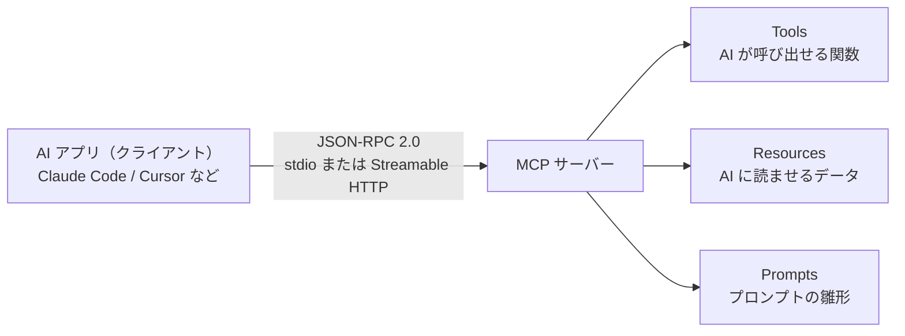
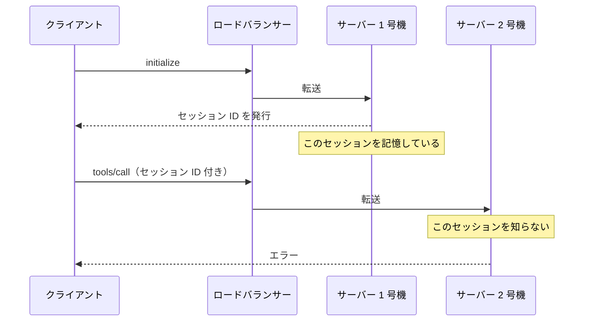
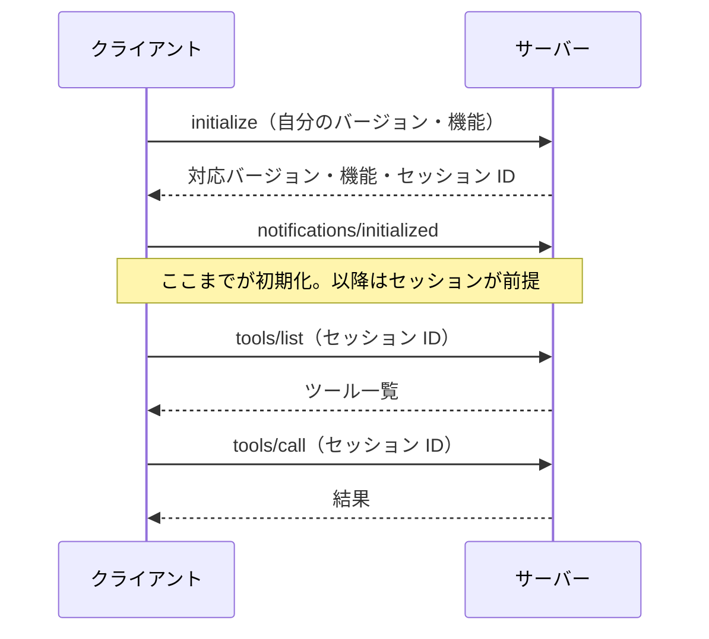
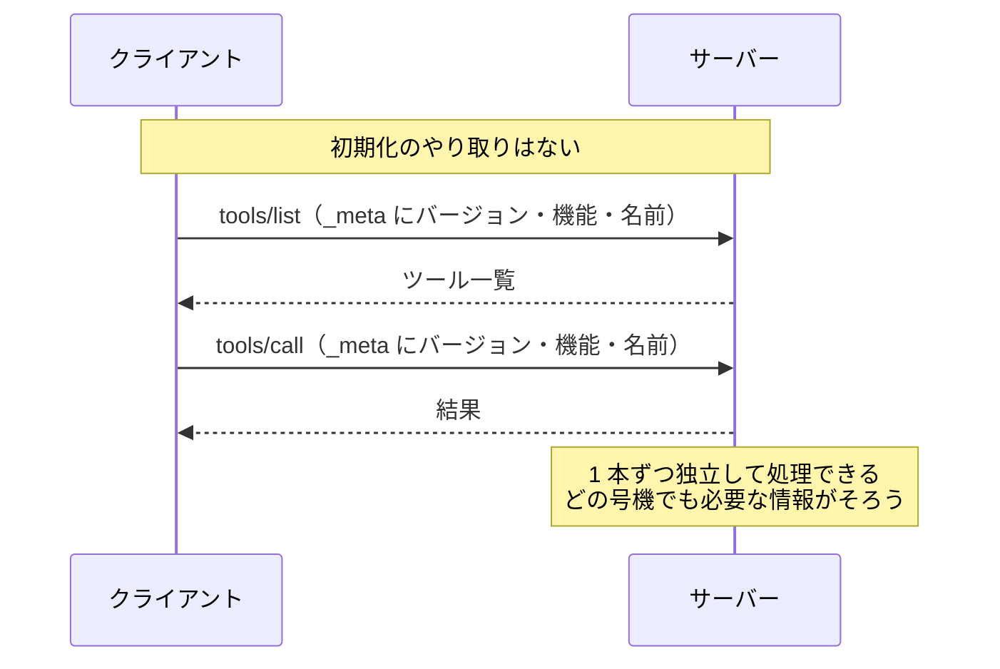
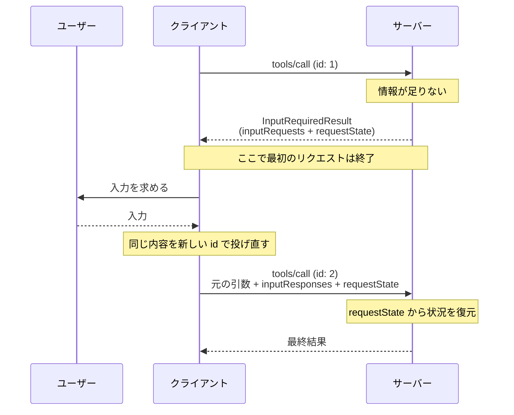
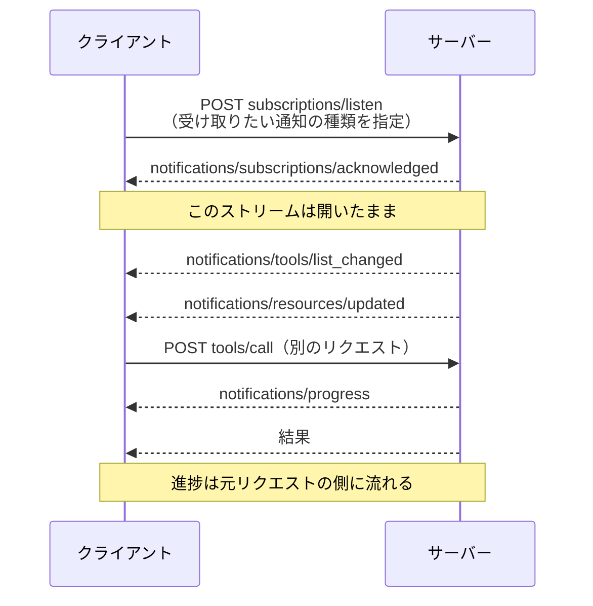

## はじめに

2026 年 7 月 28 日に、MCP（Model Context Protocol）の新しい仕様 `2026-07-28` が公開されました。

https://blog.modelcontextprotocol.io/posts/2026-07-28/

変更点の一覧を開いて最初に目に入るのが「Remove」の文字です。`initialize`、セッション ID、`ping` などが消えました。前バージョン `2025-11-25` からの差分は、追加よりも削除が目立ちます。公式発表に掲載された AWS のコメントでは、「リモート MCP の登場以来もっとも重要なリリース」と評価されています。

とはいえ、MCP を普段さわっていない人には、何が消えたのか分かりにくい変更です。

そこでこの記事は、**MCP をほとんど知らない状態から読み始めて、今回何が変わったのかを説明できる状態になる**ことを目標にします。すでに MCP を触っている方は「[3. 何が変わったのか](#3-何が変わったのか)」から読んでください。

先に結論だけ。

- **プロトコルからセッションが消えた**。`initialize` による初期化も `Mcp-Session-Id` もなくなり、リクエスト 1 本 1 本が自分のバージョンと機能を毎回名乗る形になった
- **使う側は、利用中のクライアントとサーバーの対応状況を確認する**。プロトコル自体を実装する必要はない
- **サーバーを公開している側には作業がある**。最大の作業は、セッションに置いていた状態の移行

:::note info
仕様の原文で **MUST / SHOULD / MAY** と書かれている強さは、この記事では「必須 / 推奨 / 任意」と訳し分けています。実装するときはこの差が効いてきます。
:::

## 1. そもそも MCP とは何か

MCP は、**AI アプリと外部のデータや機能をつなぐための共通規格**です。

たとえば Claude や Cursor のような AI アプリに「GitHub の Issue を読ませたい」「社内 DB を検索させたい」とします。AI アプリごとに別の接続方法を実装するのは大変です。そこで「つなぎ方」を共通化したのが MCP です。USB-C が機器とケーブルの形状を統一したのと同じ発想です。

厳密には、登場人物は 3 つです。

| 呼び方 | 実体 | 例 |
|---|---|---|
| **ホスト** | ユーザーが操作する AI アプリ | Claude、Cursor、VS Code |
| **クライアント** | ホストの中で、MCP サーバーとの通信を担当する部分 | AI アプリに組み込まれた MCP クライアント |
| **サーバー** | 機能を提供する側 | GitHub 連携、DB 検索、ファイル操作 |

普段はホストとクライアントをまとめて「AI アプリ側」と考えても問題ありません。この記事でも、通信の説明では AI アプリ側を「クライアント」と呼びます。

サーバーがクライアントに提供するものは、大きく 3 種類あります。

- **Tools（ツール）** — AI が呼び出せる関数。`create_issue` や `search_db` など
- **Resources（リソース）** — AI に読ませるデータ。ファイルや設定など
- **Prompts（プロンプト）** — 定型のプロンプトテンプレート

通信の中身は [JSON-RPC 2.0](https://www.jsonrpc.org/specification) です。「`tools/list` でツール一覧をくれ」「`tools/call` でこのツールを実行してくれ」といったメッセージを JSON で投げ合っています。

通信経路（トランスポート）は 2 つです。

- **stdio** — サーバーをローカルのプロセスとして起動し、標準入出力でやり取りする。手元で動かす場合によく使われる
- **Streamable HTTP** — サーバーを Web サーバーとして立て、HTTP でやり取りする。リモート MCP はこれ



最後にもうひとつ。MCP の仕様は、**日付そのものがバージョン番号**になっています。

```
2024-11-05 → 2025-03-26 → 2025-06-18 → 2025-11-25 → 2026-07-28
```

## 2. なぜ変わったのか

なぜここまで壊す必要があったのか。

これまでの MCP は **ステートフル**でした。クライアントとサーバーはまず `initialize` をやり取りして、互いのバージョンと機能を確認します。この最初のやり取りをハンドシェイクと呼びます。その結果は接続中の情報として保持され、以降のリクエストは「初期化は済んでいる」前提で送られます。HTTP では、サーバーがセッションを使う場合に `Mcp-Session-Id` ヘッダーで識別していました。

この設計は、サーバーが 1 台なら問題ありません。困るのはサーバーを複数台に並べたときです。



2 号機はこのクライアントを知りません。セッションを覚えているのは 1 号機だけだからです。

回避する方法はあります。セッション情報を Redis などに置いて全台で共有するか、同じクライアントからのリクエストを必ず同じサーバーへ送ります。ただし、共有ストレージや「同じ相手を同じサーバーへ送る仕組み」が必要です。インスタンスが頻繁に入れ替わるサーバーレスやエッジでは、この管理が特に難しくなります。

MCP の Tier 1 SDK は、4 言語の合計で月間約 5 億ダウンロードに達しています。利用が広がるなかで公式が選んだのが、**プロトコルそのものからセッションを取り除く**という変更でした。

> The Model Context Protocol (MCP) is a **stateless protocol**: all the information needed to process a request is contained in the request itself.
> — [Specification 2026-07-28 / Overview](https://modelcontextprotocol.io/specification/2026-07-28/basic/index)

今回の変更の大半は、この一文から逆算できます。「セッションに置いていた情報をどこに移すか」「セッションがあるから成立していた機能をどう作り直すか」。認可の強化やエラーコードの整理のように、ステートレス化とは独立した改善も混ざっていますが、幹は 1 本です。

## 3. 何が変わったのか

大きい変更を 7 つに整理しました。3-7 では、個々には小さくても実装に影響する変更をまとめます。

### 3-1. `initialize` とセッション ID が消えた

**旧**：接続したらまず `initialize` を送り、`notifications/initialized` を返して初期化を終える。HTTP でセッションを使う場合は、サーバーが `Mcp-Session-Id` を発行し、クライアントが以降のリクエストに付ける。



**新**：この初期化そのものが廃止されました。セッション ID もありません。代わりに、**すべてのリクエストが自分の素性を毎回名乗ります**。



名乗る場所は `_meta` フィールドです。

```json
{
  "jsonrpc": "2.0",
  "id": 1,
  "method": "tools/call",
  "params": {
    "name": "get_weather",
    "arguments": { "location": "Tokyo" },
    "_meta": {
      "io.modelcontextprotocol/protocolVersion": "2026-07-28",
      "io.modelcontextprotocol/clientCapabilities": {},
      "io.modelcontextprotocol/clientInfo": {
        "name": "ExampleClient",
        "version": "1.0.0"
      }
    }
  }
}
```

| キー | 必須 | 中身 |
|---|---|---|
| `io.modelcontextprotocol/protocolVersion` | 必須 | このリクエストが使う仕様バージョン |
| `io.modelcontextprotocol/clientCapabilities` | 必須 | クライアントが対応している機能 |
| `io.modelcontextprotocol/clientInfo` | 任意（推奨） | クライアント名とバージョン |
| `io.modelcontextprotocol/logLevel` | 任意 | このリクエストで出してほしいログの最低レベル |

必須のものが欠けていれば、そのリクエストはその場で突き返されます。エラーコードは `-32602`、意味は「パラメータが不正」。HTTP なら `400 Bad Request` です。

サーバーの側も名乗ります。結果の `_meta` に自分の名前とバージョンを入れて、「これを返しているのは自分です」と毎回書き添えることが推奨されています。

仕様は「接続は会話ではない」とはっきり書いています。

> an open connection, such as a STDIO process, is not a conversation or session

1 本の stdio プロセスに、無関係なリクエストが混ざって流れてくる前提で作れ。そういう要求です。

では、リクエストをまたいで情報を引き継ぎたい場合はどうするのでしょうか。サーバーが ID を発行し、クライアントにツールの引数として渡してもらいます。この ID は、サーバー側に保存した情報を参照するためにも、ID 自体に情報を含めるためにも使えます。

たとえば検索結果を少しずつ絞り込む機能なら、1 回目の呼び出しで `searchId` を返します。2 回目以降、クライアントはその `searchId` を引数に付けて送る。サーバーは受け取った ID から、前回どこまで絞ったかを引き当てます。

接続にひも付けて見えない場所で管理するのではなく、引き継ぐ情報を ID で明示する形です。

HTTP を使う場合、バージョンは 2 か所に書きます。JSON の中と、`MCP-Protocol-Version` という HTTP ヘッダーの両方です。

二度手間に見えますが、理由があります。ロードバランサーやゲートウェイは、中の JSON を開かずにヘッダーだけ見て振り分けたい。一方、サーバーは JSON を読んで処理します。両者が食い違うと、経路の途中で判断した内容とは別の処理が実行されるおそれがあります。そのため仕様は、値が一致しないリクエストを拒否するよう求めています。このときのエラーが `HeaderMismatch`、コードは `-32020` です。

### 3-2. 初期化がないなら、サーバーの情報はどこで取るのか

答えは `server/discover` という新しい RPC です。「あなたは何ができて、どのバージョンを話せますか」と聞くためのものだと思ってください。

これは**サーバー側に実装が義務づけられています**。一方、クライアントが呼ぶかどうかは自由です。

```json
{
  "jsonrpc": "2.0",
  "id": "discover-1",
  "result": {
    "resultType": "complete",
    "supportedVersions": ["2026-07-28"],
    "capabilities": {
      "tools": {},
      "resources": {}
    },
    "_meta": {
      "io.modelcontextprotocol/serverInfo": {
        "name": "ExampleServer",
        "version": "1.0.0"
      }
    },
    "instructions": "This server provides weather and resource utilities.",
    "ttlMs": 3600000,
    "cacheScope": "public"
  }
}
```

使いどころは 2 つです。ひとつは、サーバーの名前と機能と対応バージョンを一度に知りたいとき。設定画面に「このサーバーはツールとリソースを提供します」と表示するような場面です。もうひとつは、相手が新しい仕様と古い仕様のどちらで話す相手なのかを見分けたいときです。

クライアントは、`server/discover` を呼ばずに `tools/call` などを送ることもできます。バージョンが合わなければ、サーバーは対応しているバージョンをエラーで返します。

```json
{
  "jsonrpc": "2.0",
  "id": 1,
  "error": {
    "code": -32022,
    "message": "Unsupported protocol version",
    "data": {
      "supported": ["2026-07-28", "2025-11-25"],
      "requested": "1900-01-01"
    }
  }
}
```

クライアントは `supported` の中から選び直して、もう一度投げます。このエラーの名前は `UnsupportedProtocolVersionError` です。

先に初期化してバージョンを決めるのではなく、**リクエストごとにバージョンを示し、未対応なら選び直す**形になりました。

### 3-3. サーバーからの問いかけが「差し戻し」方式になった（MRTR）

ここは、今回とくに考え方が変わった部分です。

MCP には、サーバーが処理の途中でクライアント側に何かを頼む仕組みがありました。

- `elicitation/create` — ユーザーに追加入力を求める（例：「GitHub のユーザー名を入力してください」）
- `sampling/createMessage` — クライアント側の LLM に推論させる
- `roots/list` — 作業ディレクトリの一覧をもらう

旧仕様では、これをサーバーが**クライアント宛のリクエストとして送りつけて**いました。つまり通信が双方向で、そのためには接続が張りっぱなしである必要がありました。

新仕様では、これができません。代わりに入ったのが **Multi Round-Trip Requests（MRTR）** です。足りないものを伝えていったん返し、クライアントに揃えて投げ直してもらいます。



サーバーが返す途中経過はこういう形です。

```json
{
  "jsonrpc": "2.0",
  "id": 1,
  "result": {
    "resultType": "input_required",
    "inputRequests": {
      "github_login": {
        "method": "elicitation/create",
        "params": {
          "mode": "form",
          "message": "GitHub のユーザー名を入力してください",
          "requestedSchema": {
            "type": "object",
            "properties": { "name": { "type": "string" } },
            "required": ["name"]
          }
        }
      }
    },
    "requestState": "AEAD-protected blob"
  }
}
```

クライアントはユーザーから入力を集め、**新しい JSON-RPC ID で同じリクエストを送り直し**ます。再試行するリクエストには、`inputResponses` と受け取ったままの `requestState` を含めます。

```json
{
  "jsonrpc": "2.0",
  "id": 2,
  "method": "tools/call",
  "params": {
    "name": "example_tool",
    "arguments": {},
    "inputResponses": {
      "github_login": {
        "action": "accept",
        "content": { "name": "octocat" }
      }
    },
    "requestState": "AEAD-protected blob",
    "_meta": {
      "io.modelcontextprotocol/protocolVersion": "2026-07-28",
      "io.modelcontextprotocol/clientCapabilities": {
        "elicitation": {}
      }
    }
  }
}
```

ポイントは `requestState` です。

これはサーバーが作る文字列です。形式は自由で、暗号化した JSON なども使えます。クライアントは中身を解釈せず、書き換えずにそのまま返します。

サーバーはここに「どこまで処理したか」を書き込んで、クライアントに預けます。自分の側にはメモを残しません。次に同じ文字列が返ってきたら、それを開いて続きから再開します。

セッションは廃止されましたが、**アプリが扱う状態まで禁止されたわけではありません**。MRTR では、再開に必要な情報を `requestState` に入れてクライアントに返せます。別の場面では、サーバー側の情報を参照する ID をツール引数として渡す方法も使えます。重要なのは、接続に状態をひも付けず、次のリクエストだけで必要な情報を特定できるようにすることです。

その責任は、仕様にはっきり書かれています。

まず、返ってきた `requestState` は攻撃者が書き換えたものかもしれない、と考える必要があります。認可、リソースへのアクセス、業務上の判断に影響するなら、HMAC や AEAD で改ざんを検知できるようにします。検証に失敗した値は拒否しなければなりません。

同じ `requestState` を何度も使う攻撃への対策も必要です。仕様は、「誰に発行したか」「有効期限」「どのリクエスト用か」を含め、受け取るたびに照合することを推奨しています。

MRTR を使えるのは `tools/call`、`resources/read`、`prompts/get` の 3 つだけです。それ以外のリクエストで `input_required` を返してはいけません。

### 3-4. すべての結果に `resultType` が付いた

MRTR の導入に伴い、レスポンスの `result` に **`resultType` が必須**になりました。

| 値 | 意味 |
|---|---|
| `"complete"` | 完了。通常の結果 |
| `"input_required"` | 追加入力が必要。MRTR の途中経過 |

拡張機能がさらに値を追加できます（後述の Tasks 拡張は `"task"` を使います）。

古い仕様のサーバーは `resultType` を返してこないので、クライアントは**フィールドが無ければ `"complete"` とみなさなければなりません**。互換性のためのルールです。

### 3-5. 通知の受け取り方が `subscriptions/listen` に一本化された

「ツール一覧が変わった」「リソースが更新された」といったサーバー発の通知を受け取る仕組みも作り直されました。

**旧**：HTTP の GET エンドポイントを開きっぱなしにして、そこにサーバーが通知を流す。リソース個別の購読は `resources/subscribe` と `resources/unsubscribe` で行う。

**新**：GET エンドポイントも `resources/subscribe` も廃止。代わりに `subscriptions/listen` という**長時間開きっぱなしになる POST リクエスト**を 1 本投げます。そのレスポンスストリームに通知が流れてきます。

```json
{
  "jsonrpc": "2.0",
  "id": 1,
  "method": "subscriptions/listen",
  "params": {
    "_meta": { "io.modelcontextprotocol/protocolVersion": "2026-07-28", "io.modelcontextprotocol/clientCapabilities": {} },
    "notifications": {
      "toolsListChanged": true,
      "resourceSubscriptions": ["file:///project/config.json"]
    }
  }
}
```

受け取りたい通知の種類を、ここで明示的に指定します。頼んでいない種類をサーバーが勝手に送ることは許されません。

| フィールド | 受け取る通知 |
|---|---|
| `toolsListChanged` | `notifications/tools/list_changed` |
| `promptsListChanged` | `notifications/prompts/list_changed` |
| `resourcesListChanged` | `notifications/resources/list_changed` |
| `resourceSubscriptions` | 指定 URI の `notifications/resources/updated` |

サーバーは最初に `notifications/subscriptions/acknowledged` を返し、「このうち実際に対応するのはこれです」と応答します。以降の通知にはすべて `io.modelcontextprotocol/subscriptionId` が付き、これでどの購読に対する通知かを見分けます。

進捗やログの通知は、この購読には乗ってきません。進捗は、その進捗を知りたい元のリクエストの返事として流れてきます。「この処理はいまどこまで進んだか」と「サーバーの側で何かが変わった」は、流れてくる経路そのものが別になりました。



ここで矛盾を感じないでしょうか。セッションを消してステートレスにしたはずなのに、`subscriptions/listen` は接続を開きっぱなしにします。この点には仕様が自分で答えを書いています。

[公式仕様](https://modelcontextprotocol.io/specification/2026-07-28/basic/index#statelessness)では、「1 本のリクエストに対するレスポンスを開いたままにしている」と整理しています。状態はリクエストに属し、その下の接続には属しません。接続が切れれば購読も終わるため、クライアントは `subscriptions/listen` を送り直します。長時間の接続が禁止されたのではなく、**接続に状態をひも付ける設計**が廃止されました。

あわせて、SSE の再開機能（`Last-Event-ID` によるメッセージ再送）も廃止されました。ストリームが切れたら、そのリクエストは失われます。クライアントは**新しいリクエスト ID で投げ直す**必要があります。

### 3-6. Roots・Sampling・Logging が非推奨になった

削除ではなく非推奨（Deprecated）です。仕様には残っていて今も動きますが、新規実装では採用しないでくださいという扱いです。

| 機能 | 何だったか | 代替として案内されているもの |
|---|---|---|
| **Roots** | クライアントの作業ディレクトリをサーバーに知らせる | ツール引数、リソース URI、サーバー設定で渡す |
| **Sampling** | サーバーがクライアント側の LLM に推論させる | LLM プロバイダの API を直接叩く |
| **Logging** | `logging/setLevel` でログレベルを設定し、ログを送る | stdio なら `stderr`、可観測性は OpenTelemetry |

次のものも非推奨に整理されました。

- **HTTP+SSE トランスポート**（`2024-11-05` の旧方式。`2025-03-26` から非推奨扱いだったのを正式に登録）
- **Dynamic Client Registration（RFC 7591）** — [Client ID Metadata Documents](https://modelcontextprotocol.io/specification/2026-07-28/basic/authorization/client-registration#client-id-metadata-documents) へ

今回、**機能のライフサイクルと非推奨ポリシー**も決まりました。機能は Active（提供中）/ Deprecated（非推奨）/ Removed（削除済み）の 3 状態で管理されます。原則として、非推奨から削除までは最低 12 か月です。Roots・Sampling・Logging・DCR は「2027-07-28 以降に出る最初のリビジョン」から削除の対象になり得ます。

なお、以前から非推奨だった HTTP+SSE などには移行措置があり、削除可能になる時期が異なります。正確な時期は公式の一覧で確認してください。

撤去の時期が事前に分かるようになりました。[非推奨機能のレジストリ](https://modelcontextprotocol.io/specification/2026-07-28/deprecated)も公式に用意されているので、ときどき見に行けば済みます。

### 3-7. 消えた API と、増えた小さいルール

| 消えたもの | 代わり |
|---|---|
| `initialize` / `notifications/initialized` | 毎リクエストの `_meta` |
| `Mcp-Session-Id` ヘッダー | 直接の代替はない。呼び出しをまたぐ情報は、必要に応じて明示的な ID で参照する |
| HTTP の GET エンドポイント | `subscriptions/listen` |
| `resources/subscribe` / `resources/unsubscribe` | `subscriptions/listen` の `resourceSubscriptions` |
| `ping` | （廃止） |
| `logging/setLevel` | `_meta` の `io.modelcontextprotocol/logLevel` を毎リクエスト指定 |
| `notifications/roots/list_changed` | （廃止） |
| `Last-Event-ID` によるストリーム再開 | 新しいリクエスト ID で投げ直す |
| サーバー起点のリクエスト | MRTR |
| `tasks/*`（コア） | `io.modelcontextprotocol/tasks` 拡張へ移動 |

ここからは、逆に増えたルールです。

#### HTTP ヘッダーが必須になった

Streamable HTTP のリクエストには、JSON の一部を次のヘッダーにも写します。ゲートウェイや WAF が、JSON を開かずに振り分けや遮断を判断できるようにするためです。

| ヘッダー | 付けるリクエスト | 値 |
|---|---|---|
| `MCP-Protocol-Version` | すべての POST | 仕様バージョン |
| `Mcp-Method` | すべてのリクエスト | `tools/call` などのメソッド名 |
| `Mcp-Name` | `tools/call`、`resources/read`、`prompts/get` | ツール名、リソース URI、プロンプト名 |

ヘッダーと JSON の値が食い違う場合、サーバーはリクエストを拒否します。

```http
POST /mcp HTTP/1.1
Content-Type: application/json
MCP-Protocol-Version: 2026-07-28
Mcp-Method: tools/call
Mcp-Name: get_weather
```

#### ツール引数をヘッダーに写せるようになった

使うには、ツール定義の該当プロパティに `x-mcp-header` を書きます。

たとえば SQL を実行するツールに `region` という引数があるとします。これをヘッダーに写しておけば、ゲートウェイは JSON を開かずに「このリクエストは us-west1 行き」と判断できます。サーバーがこの機能を使うかどうかは任意ですが、クライアントは対応しなければなりません。

```json
{
  "name": "execute_sql",
  "inputSchema": {
    "type": "object",
    "properties": {
      "region": { "type": "string", "x-mcp-header": "Region" },
      "query": { "type": "string" }
    },
    "required": ["region", "query"]
  }
}
```

→ `Mcp-Param-Region: us-west1` が付く。

#### 一覧系のレスポンスにキャッシュ指示が必須になった

一覧を返す種類のレスポンスに、「この結果は何ミリ秒のあいだ使い回してよいか」を書くことが必須になりました。フィールド名は `ttlMs` です。あわせて `cacheScope` に `"public"` か `"private"` を書き、途中の共有プロキシがキャッシュしてよいかも示します。対象は `tools/list` や `resources/read` など、一覧と読み取り系の 5 つです。

おかげでクライアントは、毎回一覧を取り直さずに済みます。`tools/list` については、毎回同じ順序で返すことも推奨されました。順序が揺れると、LLM のプロンプトキャッシュが効かなくなるからです。

#### エラーコードが整理された

JSON-RPC のサーバーエラー範囲を分割し、`-32000`〜`-32019` は既存実装用、`-32020`〜`-32099` を MCP 仕様専用としました。リソース未検出のコードも `-32002` から `-32602`（Invalid Params）に変わっています。

#### 認可が強化された

認可サーバーは、認可レスポンスに `iss` という発行元を示すパラメータを含めることが推奨されました（[RFC 9207](https://datatracker.ietf.org/doc/html/rfc9207)）。クライアントの側は、`iss` が入っていたら、自分が記録している発行元と一致するかを必ず確かめます。一致しないまま認可コードを引き換えてはいけません。認可サーバーをすり替える攻撃を防ぐためです。

もうひとつ、クライアントが持っている資格情報は、それを発行した認可サーバー専用のものだと明記されました。別の認可サーバーに同じものを持っていくことは許されません。

#### Tasks が拡張に移った

実験的にコアに入っていた長時間処理の仕組みが `io.modelcontextprotocol/tasks` 拡張に移り、設計も変わりました。ブロッキングする `tasks/result` を廃止して `tasks/get` によるポーリングにし、途中入力用の `tasks/update` が入りました。CI パイプラインや承認待ちのような、数分〜数時間かかる処理はこちらを使います。

## 4. MCP を使う側は何をすればいいのか

では、自分は何かしなければいけないのか。ここからは立場を分けて書きます。まず使う側、つまり Claude Code や Cursor に MCP サーバーを設定して使っている人です。

**プロトコルを自分で実装する必要はありません。** ただし、利用中のクライアントと MCP サーバーが新仕様に対応しているかは確認してください。製品ごとの設定方法や対応時期は、それぞれの公式情報に従います。

知っておくと困らないことが 3 つあります。

### 4-1. 新旧の組み合わせによっては動かない

仕様に、新旧どの組み合わせなら動くかの表が載っています。新方式が `2026-07-28` 以降、旧方式が `2025-11-25` 以前です。

| クライアント | サーバー | 結果 |
|---|---|---|
| 新方式のみ | 新方式のみ | 動く |
| 新方式のみ | 両対応 | 動く |
| **新方式のみ** | **旧方式のみ** | **動かない** |
| 両対応 | 新方式のみ | 動く |
| 両対応 | 両対応 | 動く |
| 両対応 | 旧方式のみ | 動く |
| **旧方式のみ** | **新方式のみ** | **動かない** |
| 旧方式のみ | 両対応 | 動く |
| 旧方式のみ | 旧方式のみ | 動く |

つまり、新方式だけを話すクライアントと旧方式だけを話すサーバーは通信できません。逆の組み合わせも同じです。新旧の両方に対応する実装なら、相手に合わせて方式を切り替えられます。実際の対応範囲は、利用中の製品や SDK の公式情報で確認してください。

旧方式だけに対応するクライアントは、新方式へ自動で切り替えられません。この場合は、クライアントを更新する必要があります。そのため仕様は、新方式のサーバーに対して「`initialize` が来たら、エラーメッセージに対応バージョンを書く」ことを推奨しています。旧クライアントがユーザーに示せる、唯一の手がかりになる場合があるためです。

### 4-2. Sampling を使うサーバーは将来動かなくなる可能性がある

Sampling は「サーバーが、クライアント側の LLM を借りて推論する」機能です。サーバー側に API キーを持たせずに済むので便利でしたが、非推奨になりました。代替は「LLM プロバイダの API を直接叩く」、つまり**サーバー側で API キーを用意する**方向です。

同様に Roots も非推奨なので、「クライアントの作業ディレクトリを自動で認識する」タイプのサーバーは、将来的にパスを引数で渡す形に変わる可能性があります。

いずれも最短で 2027 年 7 月以降の話なので、今すぐ何かする必要はありません。

### 4-3. サーバーを選ぶときの見どころが増えた

これから MCP サーバーを選ぶなら、`2026-07-28` に対応しているかを確認しましょう。新仕様では、リモート MCP サーバーをサーバーレスやエッジに配置しやすくなりました。プロトコル上のセッションを共有する Redis や、同じ利用者を同じサーバーへ送る仕組みが不要になるためです。クライアントが `ttlMs` に従ってキャッシュすれば、ツール一覧を毎回取り直す必要もありません。

Claude 製品については、Anthropic が「順次対応を展開する」と発表しています。どの製品がいつ対応するかは、この発表では個別に示されていません。

https://claude.com/blog/bringing-mcp-2026-07-28-to-claude

## 5. MCP サーバーを公開する側は何をすればいいのか

使う側と違って、こちらは作業があります。破壊的変更なので、放っておくと新しいクライアントから使えなくなります。

移行のチェックリストを 8 項目に絞りました。上から順に効きます。

### 5-1. SDK を上げる

TypeScript / Python / Go / C# の Tier 1 SDK は `2026-07-28` に対応済みです（Rust はベータ）。ここを上げないと始まりません。

### 5-2. セッションに置いていた状態を洗い出す

いちばん重い作業です。「`initialize` のときに受け取って、以降のリクエストで使っていた値」がある場合、それは置き場所を失います。

主な移行方法は次の 3 つです。

- 複数のツール呼び出しで情報を共有するなら、サーバーが ID を発行し、ツール引数として往復させる
- MRTR の再試行に必要な情報なら、`requestState` に含める
- 長時間かかる処理なら、Tasks 拡張の `taskId` を使う

どの方法でも、次のリクエストだけで必要な情報を特定できるようにします。

いずれにせよ、「この接続から来たのだから、さっきと同じ相手のはずだ」という前提の実装は成り立ちません。1 本の stdio プロセスに、無関係な会話のリクエストが混ざって届く前提で書き直します。

### 5-3. `server/discover` を実装する

対応しているバージョン、提供している機能、自分の名前とバージョン、それに使い方の説明を返します。実装は義務です。`ttlMs` と `cacheScope` を付けておけば、クライアントに結果を持たせておくこともできます。

### 5-4. サーバー起点のリクエストを MRTR に置き換える

`elicitation/create`、`sampling/createMessage`、`roots/list` をサーバーから送っていた箇所は、すべて `InputRequiredResult` を返す形に書き換えます。

このとき `requestState` の設計を必ず考えてください。**改ざんされる前提**で扱います。認可、リソースへのアクセス、業務上の判断に影響するなら、HMAC や AEAD で改ざんを検知できるようにします。さらに、次の情報を含めて検証することが推奨されています。

- 誰に発行したものか（別のユーザーが持ってきた `requestState` を拒否するため）
- いつまで有効か
- どのリクエストに対して発行したか（メソッド名と主要な引数のダイジェストなど）

「一度しか使わせたくない」`requestState` については、これらだけでは足りません。サーバー側で使用済みかどうかを管理する必要があります。

Sampling と Roots はそもそも非推奨です。書き換えるついでに**依存自体をやめる**選択も検討する価値があります。

### 5-5. 通知まわりを `subscriptions/listen` に移す

`resources/subscribe` と GET エンドポイントをやめ、`subscriptions/listen` に一本化します。旧クライアントから GET や DELETE が来たら `405 Method Not Allowed` を返し、`Mcp-Session-Id` や `Last-Event-ID` ヘッダーは無視します。

長く開いたままの通知ストリームでは、`:` だけの行をときどき流しておくことが推奨されています。SSE ではこれがコメント扱いになり、クライアントは読み飛ばします。何も流れない時間が続くと、途中のプロキシやアイドルタイムアウトに切られてしまうので、その予防です。レスポンスに `X-Accel-Buffering: no` を付けることも推奨されています。nginx などがレスポンスを溜め込んでから流すのを止めるためです。

### 5-6. すべての結果に `resultType` とキャッシュ情報を付ける

返すすべての結果に `resultType` を入れます。通常は `"complete"` です。

一覧と読み取り系の 5 つには、`ttlMs` と `cacheScope` も必須です。`cacheScope` は、途中の共有プロキシがこの結果をキャッシュしてよいかの判断に使われます。**ユーザーごとに内容が変わるなら必ず `"private"`** にしてください。ここを間違えると情報漏洩になります。

`tools/list` は毎回同じ順序で返してください。順序が揺れると、クライアント側のキャッシュと LLM のプロンプトキャッシュの両方が効かなくなります。

### 5-7. HTTP ヘッダーを検証する

`MCP-Protocol-Version` と `Mcp-Method` を受け取り、対象のメソッドでは `Mcp-Name` も受け取ります。これらが **JSON の値と一致するか検証**します。一致しなければ `400 Bad Request` と `HeaderMismatch`（`-32020`）を返します。これは、「ロードバランサーはヘッダーを見て、サーバーは JSON を見る」という違いを悪用した攻撃を防ぐための要件です。

`Mcp-Name` や `Mcp-Param-*` は Base64 で符号化されて届くことがあります（`=?base64?...?=` という形式）。比較する前に復号してください。

### 5-8. 認可を見直す

- **Dynamic Client Registration から Client ID Metadata Documents へ**。DCR は互換性のために残りますが非推奨です
- クライアント資格情報は**発行元の issuer をキーにして保存**し、別の認可サーバーで使い回さない
- 認可レスポンスに `iss` を含める（推奨）

## 6. まとめ

`2026-07-28` の変更を 1 行にすると、**「MCP からセッションを取り除き、リクエスト 1 本 1 本を独立させた」**です。

そこから派生したのが、次の変更です。

- 初期化（`initialize`）が消え、毎リクエストが `_meta` で名乗るようになった
- その代わりに `server/discover` が入った
- サーバーからの問いかけは、いったん返して聞き直してもらう MRTR に変わった
- 通知は `subscriptions/listen` に一本化された
- 双方向・状態ありきだった Roots / Sampling / Logging が非推奨になった
- ゲートウェイが扱いやすいようにヘッダーとキャッシュ指示が増えた

ただし、セッションの廃止は、アプリが扱う状態まで消すという意味ではありません。複数のリクエストで使う状態は、ツール引数で渡す ID や MRTR の `requestState` などで明示します。`requestState` が重要な判断に影響する場合は、改ざんを検知できなければなりません。ステートレス化の要点は、**接続に状態を隠さず、次のリクエストだけで必要な情報を特定できるようにすること**です。

使う側の作業は、利用中の製品とサーバーの対応状況を確認し、必要なら更新することです。サーバーを公開する側では、セッションに置いていた状態の確認が最大の作業になります。まず `initialize` の処理を開き、そこで受け取って後のリクエストでも使う値を書き出してください。それが移行対象の一覧になります。

もうひとつ実務に影響するのが、機能のライフサイクルと非推奨ポリシーです。原則として最低 12 か月の移行期間があり、非推奨機能の一覧も公開されます。削除の候補になる時期を確認できるため、移行を計画しやすくなりました。

## 参考

- [Specification 2026-07-28](https://modelcontextprotocol.io/specification/2026-07-28/) — 公式仕様
- [Key Changes](https://modelcontextprotocol.io/specification/2026-07-28/changelog) — 変更点一覧
- [The 2026-07-28 Specification](https://blog.modelcontextprotocol.io/posts/2026-07-28/) — 公式アナウンス
- [Multi Round-Trip Requests](https://modelcontextprotocol.io/specification/2026-07-28/basic/patterns/mrtr) — MRTR の詳細
- [Deprecated Features](https://modelcontextprotocol.io/specification/2026-07-28/deprecated) — 非推奨機能のレジストリ
- [Extensions Overview](https://modelcontextprotocol.io/docs/extensions/overview) — 拡張機能の一覧と交渉方法
