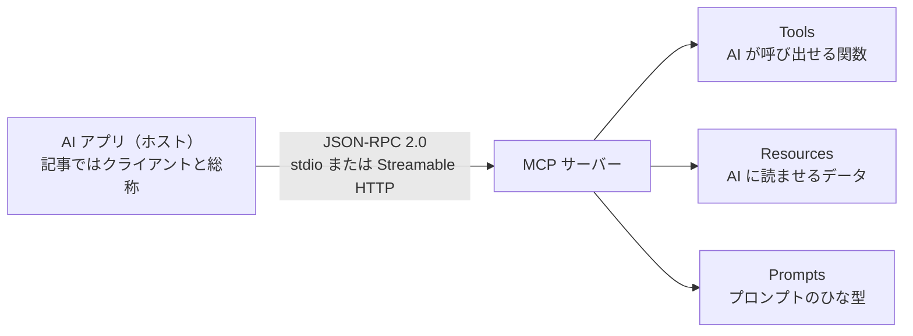
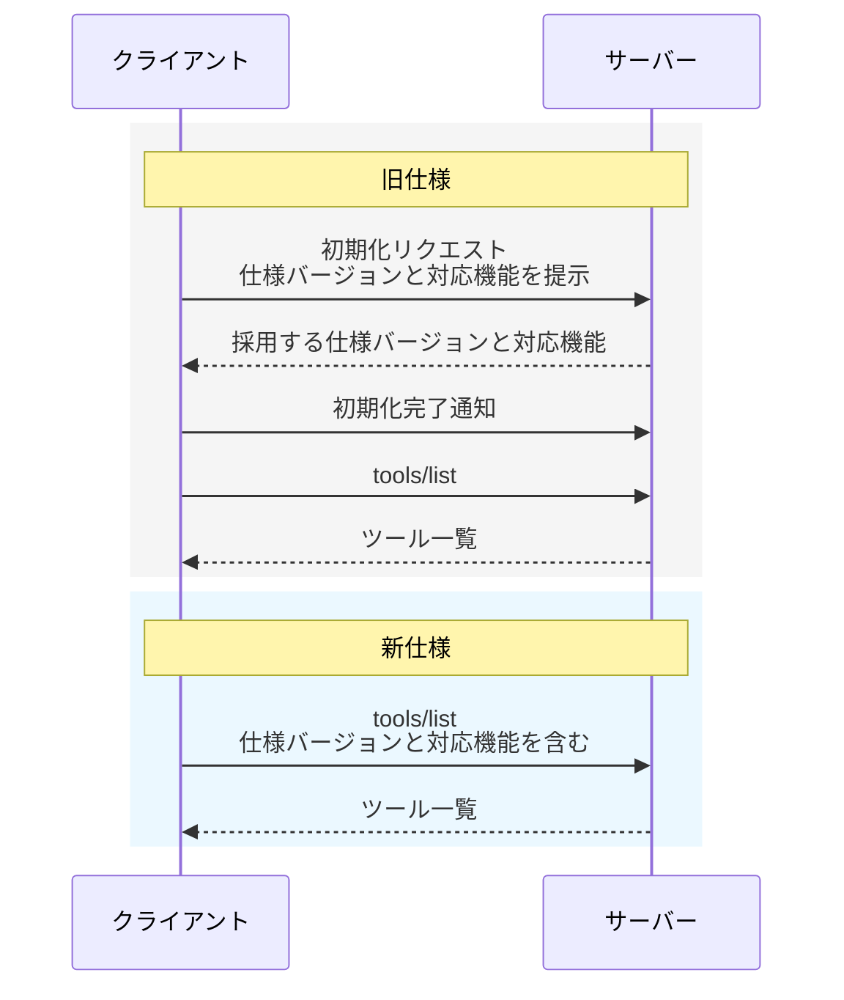

## はじめに

2026 年 7 月 28 日に、MCP（Model Context Protocol）の新仕様 [`2026-07-28`](https://modelcontextprotocol.io/specification/2026-07-28/) が公開されました。

この記事では、MCP を初めて知る人に向けて、まず MCP とは何かを基本的な仕組みから説明します。そのうえで、旧仕様にどのような課題があり、新仕様でどう変わったのかを見ていきます。

今回の大きな変更は、**MCP の中核が、それまでのやり取りを前提にするステートフルな方式から、各リクエストを独立して処理するステートレスな方式へ変わったこと**です。

## 1. そもそも MCP とは何か

MCP は、**AI アプリと外部システムが、決まった形式でメッセージを送受信するためのオープンな通信規約**です。

たとえば、Claude Desktop や Cursor のような AI アプリに、GitHub の Issue を読ませたり、社内のデータベースを検索させたりするとします。AI アプリごとに別の接続方法を作ると、連携先が増えるたびに実装も増えます。

そこで、AI アプリと外部システムの間で、メッセージを送受信する方法を共通化したのが MCP です。

MCP には、次の 3 つの役割があります。

| 役割 | 内容 |
|---|---|
| **ホスト** | ユーザーが操作する AI アプリ。複数のクライアントを管理する |
| **クライアント** | ホストの中で、特定の MCP サーバーとの通信を担当する部分 |
| **サーバー** | データや機能を提供する側。GitHub 連携や DB 検索など |

この記事では説明を短くするため、ホストとクライアントをまとめて「クライアント」と呼びます。

クライアントからサーバーへの 1 回の処理依頼を**リクエスト**、サーバーが返す結果を**応答**と呼びます。この記事でいう**通信**は、リクエストや応答、通知を含む送受信全体のことです。

サーバーがクライアントに提供するものは、大きく 3 種類あります。

- **Tools（ツール）** — AI が呼び出せる関数。`create_issue` や `search_db` など
- **Resources（リソース）** — AI に読ませるデータ。ファイルや設定など
- **Prompts（プロンプト）** — 繰り返し使えるプロンプトのひな型

MCP のメッセージには [JSON-RPC 2.0](https://www.jsonrpc.org/specification) を使います。クライアントとサーバーは、「`tools/list` でツール一覧を取得する」「`tools/call` でツールを実行する」といったメッセージを JSON で送受信します。

標準の通信経路（トランスポート）は 2 つです。

- **stdio** — サーバーを手元のコンピューターでプログラムとして起動し、そのプログラムの入力と出力を使って送受信する
- **Streamable HTTP** — Web で広く使われる HTTP で送受信する。離れた場所にあるサーバーとの通信によく使われる

図にすると、AI アプリと MCP サーバーの関係は次のようになります。

[MCP の仕様バージョン](https://modelcontextprotocol.io/docs/learn/versioning)は、`YYYY-MM-DD` 形式です。クライアントとサーバーは、この値を使って、どの時点のルールに従うかを伝えます。

## 2. 新仕様で通信の始め方がどう変わったのか

新旧仕様の違いは、「最初に決めた情報を使い続ける」方式から、「必要な情報をリクエストごとに伝える」方式へ変わったことです。

### 2-1. 旧仕様：初期化してから処理を始める

[`2025-11-25` の旧仕様](https://modelcontextprotocol.io/specification/2025-11-25/basic/lifecycle)では、ツールの利用などを始める前に、クライアントが**初期化リクエスト**を送っていました。初期化リクエストは、これから使うルールや互いに扱える機能を確認するためのリクエストです。メソッド名は `initialize` です。

クライアントは、自分が対応する仕様バージョンと対応機能を初期化リクエストで伝えます。サーバーは、採用する仕様バージョンとサーバー側の対応機能を応答で返します。

ここでいう**対応機能（capabilities）**とは、MCP のどの機能を扱えるかを示す情報です。たとえば、サーバーはツールを提供できるか、クライアントはサーバーから求められた追加情報を返せるか、といった違いを伝えます。

クライアントが初期化の完了を通知すると、ツールの一覧取得や実行に進めます。この一連のやり取りを、この記事では**初期化手順**と呼びます。

### 2-2. 新仕様：必要な情報をリクエストごとに送る

新仕様では、初期化手順を廃止しました。クライアントは、ツール一覧の取得やツールの実行を最初からリクエストできます。

その代わり、すべてのリクエストに「そのリクエストで使う仕様バージョン」と「その処理に関係するクライアントの対応機能」を含めます。旧仕様と新仕様の流れを並べると、違いが分かりやすくなります。

仕様バージョンと対応機能は、リクエストの `params._meta` に入れます。サーバーは、過去のやり取りではなく、今届いたリクエストを見て、どのルールと機能を使うか判断します。

### 2-3. なぜリクエストを独立させたのか

旧仕様では、後から届くリクエストが、初期化手順で決めた内容を前提にしていました。HTTP では、サーバーが `Mcp-Session-Id` を発行し、複数のリクエストを同じセッションとして扱うこともできました。

この方式でサーバーを複数台に増やすと、次のリクエストが初期化手順で決めた情報を持たないサーバーへ届く可能性があります。情報を共有する保存場所を用意するか、同じクライアントからのリクエストを同じサーバーへ送り続けなければ、処理を続けられません。

[新仕様](https://modelcontextprotocol.io/specification/2026-07-28/basic/index#statelessness)では、各リクエストに仕様バージョンと対応機能が入っています。過去の通信に頼らず、リクエストを 1 本ずつ処理できるため、複数台のサーバーへ振り分けやすくなります。この性質を**ステートレス**と呼びます。

### 2-4. 検索の続きや長時間処理は引き継げる

廃止されたのは、`Mcp-Session-Id` を使うプロトコル上のセッションです。検索条件や処理の進捗まで保存できなくなったわけではありません。

複数のリクエストにまたがる処理では、サーバーが検索 ID などを発行し、クライアントが次のリクエストでその ID を返します。サーバーは明示された ID から、どの処理の続きかを判断します。

つまり、新仕様でも処理状況は引き継げます。ただし、「同じ接続から届いたから前回の続きだろう」と推測せず、リクエスト内の情報で続きの処理を特定します。

## 3. `2026-07-28` の主な変更点

初期化手順とセッションの廃止に伴い、リクエストに含める情報、応答の種類、通知の受け取り方が変わりました。非推奨になった機能も含め、主な変更を順に説明します。

### 3-1. リクエストごとにクライアントの情報を渡す

各リクエストの `params._meta` には、次のキーを使います。

| キー | 仕様上の扱い | 中身 |
|---|---|---|
| `io.modelcontextprotocol/protocolVersion` | 必須 | このリクエストが使う仕様バージョン |
| `io.modelcontextprotocol/clientCapabilities` | 必須 | このリクエストに関係するクライアントの対応機能 |
| `io.modelcontextprotocol/clientInfo` | 推奨（設定により省略可） | クライアント名とソフトウェアのバージョン |
| `io.modelcontextprotocol/logLevel` | 任意 | このリクエストで出してほしいログの最低レベル |

必須フィールドが欠けていれば、サーバーはそのリクエストを拒否する必要があります。JSON-RPC のエラーコードは `-32602`（`Invalid params`）です。Streamable HTTP では、HTTP ステータスに `400 Bad Request` を使う必要があります。

サーバーは、結果の `_meta` に `io.modelcontextprotocol/serverInfo` を追加することが推奨されています。このフィールドには、サーバー名とソフトウェアのバージョンを入れます。

### 3-2. サーバーの対応機能と仕様バージョンはどう確認するのか

サーバーの対応機能と仕様バージョンは、新しいリクエスト [`server/discover`](https://modelcontextprotocol.io/specification/2026-07-28/server/discover) で確認します。

サーバーは `server/discover` を実装する必要がありますが、クライアントが呼ぶかどうかは任意です。応答には、サーバーが対応する仕様バージョンと対応機能が含まれます。

新旧両方に対応する stdio クライアントには、最初に `server/discover` を送ることが推奨されています。新仕様に対応したサーバーかどうかを、この応答で判定できます。

クライアントは、`server/discover` を呼ばずに `tools/call` などを送ることもできます。指定した仕様バージョンにサーバーが対応していなければ、サーバーは `UnsupportedProtocolVersionError`（`-32022`）を返す必要があります。

このエラーの `data.supported` には、サーバーが対応している仕様バージョンの一覧が入ります。双方が対応する仕様バージョンがあれば、クライアントはそのバージョンを選び、リクエストを再送することが推奨されています。

初期化手順で仕様バージョンを一度だけ決める方式から、**リクエストごとに仕様バージョンを示し、未対応なら選び直す方式**へ変わりました。

### 3-3. 追加情報は「応答して再送する」方式になった（MRTR）

ツールの実行中に追加情報が必要になった場合も、リクエストを独立させたまま処理します。

たとえば、ファイルを削除する前に、サーバーがユーザーへ確認したい場合です。旧仕様では、サーバーからクライアントへ別のリクエストを送り、追加情報を求めていました。

- `elicitation/create` — ユーザーに追加入力を求める（例：「GitHub のユーザー名を入力してください」）
- `sampling/createMessage` — クライアント側の LLM に回答を作らせる
- `roots/list` — 作業ディレクトリの一覧をもらう

新仕様では、サーバーから独立したリクエストを送れません。代わりに使うのが [Multi Round-Trip Requests](https://modelcontextprotocol.io/specification/2026-07-28/basic/patterns/mrtr)（MRTR、複数回の往復）です。

サーバーはいったん「追加の情報が必要」と応答します。クライアントは必要な情報を集め、元のリクエストを送り直します。次の図で、最初のリクエストから再送までの流れを示します。

MRTR で使う主なフィールドは、次の 3 つです。

| フィールド | 役割 |
|---|---|
| `inputRequests` | サーバーが応答に含める、追加情報の依頼。省略可能 |
| `inputResponses` | クライアントが再送時に含める、`inputRequests` への回答 |
| `requestState` | サーバーだけが中身を解釈する文字列。省略可能 |

`InputRequiredResult` には、`inputRequests` と `requestState` の少なくとも一方が必要です。クライアントは `requestState` の中身を解釈せず、再送時に同じ値を返します。

最初のリクエストと再送したリクエストは、それぞれ独立しています。最初に応答したサーバーのメモリだけに途中経過を残すと、別のサーバーが再送を受け取ったときに処理を再開できません。

サーバーは、再開に必要な情報を `requestState` 自体に含めるか、`requestState` を手がかりに共有ストレージから取得します。これにより、最初に応答したサーバーとは別のサーバーでも再送を処理できます。

基本仕様で MRTR を使えるのは `tools/call`、`resources/read`、`prompts/get` の 3 つだけです。サーバーは、それ以外のリクエストで `input_required` を返してはいけません。

### 3-4. 応答の種類を `resultType` で示す

MRTR の導入に伴い、エラーではなく `result` を返すすべての応答で、`resultType` が必須になりました。

| 値 | 意味 |
|---|---|
| `"complete"` | 完了。通常の結果 |
| `"input_required"` | 追加入力が必要。MRTR の途中経過 |

基本仕様とは別に更新される任意の機能を、拡張機能と呼びます。拡張機能は `resultType` に別の値を追加できます。

たとえば、長時間処理を扱う [Tasks 拡張](https://modelcontextprotocol.io/extensions/tasks/overview)では `"task"` を使います。旧仕様で実験的にコア仕様へ入っていた Tasks は、拡張機能へ移りました。メッセージの流れも変わったため、新旧の Tasks に互換性はありません。

サーバーが `"task"` を返せるのは、クライアントとサーバーの両方が Tasks 拡張への対応を示した場合だけです。

旧仕様には `resultType` がありません。そのため、クライアントが旧仕様のサーバーから `resultType` のない結果を受け取った場合は、処理の完了を示す `"complete"` として扱う必要があります。

### 3-5. 通知は `subscriptions/listen` で受け取る

「ツール一覧が変わった」「リソースが更新された」といった通知は、新しい `subscriptions/listen` にまとまりました。

- **旧仕様**：通知用の HTTP GET 接続を開いておく。特定のリソースの更新を継続して受け取る場合は、`resources/subscribe` と `resources/unsubscribe` を使う
- **新仕様**：通知用の HTTP GET 接続、`resources/subscribe`、`resources/unsubscribe` を廃止し、[`subscriptions/listen`](https://modelcontextprotocol.io/specification/2026-07-28/basic/patterns/subscriptions) にまとめる

Streamable HTTP のクライアントは、`subscriptions/listen` という POST リクエストを送ります。サーバーは、そのリクエストへの応答を開いたままにし、SSE で通知を送ります。

クライアントは、受け取りたい通知の種類を指定します。サーバーは最初に `notifications/subscriptions/acknowledged` を送り、受け付けた通知の種類を伝えます。各通知には、どの購読に対応するかを示す `io.modelcontextprotocol/subscriptionId` が入ります。

Streamable HTTP では、ツール一覧やリソースの変更は `subscriptions/listen` の応答ストリームに届きます。一方、ツール実行の進捗は、元のリクエストに対応する応答ストリームに届きます。次の図は、この 2 つの経路を示しています。

`subscriptions/listen` は応答ストリームを開いたままにしますが、セッションではありません。ストリームが切れた場合は、途中から再開せず、新しいリクエスト ID で `subscriptions/listen` を送り直します。

### 3-6. Roots・Sampling・Logging が非推奨になった

Roots、Sampling、Logging は、削除ではなく非推奨（Deprecated）になりました。非推奨の期間中も利用できますが、新しい実装には採用しないことが推奨されています。

次の表は、一対一の代替機能を示すものではありません。公式仕様が移行時の選択肢として示している方法です。

| 機能 | 何だったか | 移行時の選択肢 |
|---|---|---|
| **Roots** | クライアントの作業ディレクトリをサーバーに知らせる | ツール引数、リソース URI、サーバー設定で渡す |
| **Sampling** | サーバーがクライアント側の LLM に回答を作らせる | LLM 提供元の API を直接利用する |
| **Logging** | MCP の通知としてログを送る | stdio では `stderr`、ログや処理の流れを記録する場合は標準技術の OpenTelemetry を使う |

次の仕組みも非推奨です。

- **HTTP+SSE トランスポート**（`2025-03-26` から非推奨）
- 認可サーバーへクライアントを自動登録する **Dynamic Client Registration（RFC 7591）**

Dynamic Client Registration の代わりに、新しい実装では [Client ID Metadata Documents](https://modelcontextprotocol.io/specification/2026-07-28/basic/authorization/client-registration#client-id-metadata-documents) の利用が推奨されています。対応していない認可サーバーとの互換性を保つ場合は、Dynamic Client Registration を引き続き使えます。

移行時期は機能によって異なります。公式の[非推奨機能の一覧](https://modelcontextprotocol.io/specification/2026-07-28/deprecated)を確認してください。

### 3-7. API・エラーコード・JSON Schema の変更

ここまで取り上げていない変更のうち、既存実装に影響するものをまとめます。

| 変更 | 内容 |
|---|---|
| API の廃止 | `ping`、`logging/setLevel`、`notifications/roots/list_changed`、`notifications/elicitation/complete` を廃止した。URL モードの Elicitation から `elicitationId` も削除した |
| エラーコード | `-32020`〜`-32099` を MCP 仕様専用に整理した。リソースが見つからない場合のコードは `-32002` から `-32602` へ変更した。旧サーバーから届く `-32002` は引き続き受け入れることが推奨される |
| JSON Schema | ツールの `inputSchema` と `outputSchema` で JSON Schema 2020-12 のキーワードを使えるようにした。`structuredContent` はオブジェクト以外の JSON 値も扱える |

## 4. MCP を使う側は何をすればいいのか

Claude Code や Cursor に MCP サーバーを設定して使っている人は、互換性と非推奨機能の 2 点を確認します。

MCP を設定して使うだけなら、プロトコルを自分で実装する必要はありません。ただし、利用中のクライアントと MCP サーバーが新仕様に対応しているかは確認してください。製品ごとの設定方法や対応時期は、それぞれの公式情報に従います。

### 4-1. 新旧の組み合わせによっては動かない

新方式だけに対応する製品と、旧方式だけに対応する製品は組み合わせられません。MCP の[公式な互換性表](https://modelcontextprotocol.io/specification/2026-07-28/basic/versioning#compatibility-matrix)では、`2026-07-28` 以降を新方式、`2025-11-25` 以前を旧方式としています。

動かないのは、次の 2 通りです。

| クライアント | サーバー |
|---|---|
| 新方式のみ | 旧方式のみ |
| 旧方式のみ | 新方式のみ |

どちらかが新旧の両方に対応していれば、相手に合わせて方式を切り替えられます。実際の対応範囲は、利用中の製品や SDK の公式情報で確認してください。

新方式だけの相手と組み合わせる場合は、旧方式だけの製品を対応版へ更新するか、対応する製品へ置き換える必要があります。

### 4-2. 非推奨機能を使うサーバーは将来変わる可能性がある

Sampling、Roots、Logging を使うサーバーは、非推奨機能から移行するときに設定や動作が変わる可能性があります。ただし、これらの機能は `2026-07-28` で削除されたわけではありません。

利用中のサーバーから移行案内が出ていないか確認してください。

## 5. MCP サーバーを公開する側は何をすればいいのか

旧仕様のサーバーを新仕様へ移行するときは、次の順に実装を見直します。MCP を設定して使うだけであれば、「[6. まとめ](#6-まとめ)」へ進んでください。

### 5-1. SDK と起動方法を更新する

[2026 年 7 月 28 日の公式発表](https://blog.modelcontextprotocol.io/posts/2026-07-28/#sdks)時点では、TypeScript、Python、Go、C# 向け SDK が `2026-07-28` に対応済みです。Rust SDK は正式版前のベータ版で対応しています。

利用中の言語のリリースノートや移行ガイドを確認し、対応版へ更新します。

以下は TypeScript SDK を移行する場合の要点です。v2 には Node.js 20 以上が必要で、従来の `@modelcontextprotocol/sdk` は、サーバー用の `@modelcontextprotocol/server` やクライアント用の `@modelcontextprotocol/client` などに分かれました。

v1 から移行する場合は、パッケージのルートで `npx @modelcontextprotocol/codemod@latest v1-to-v2 .` を実行できます。変換後は[公式の移行ガイド](https://ts.sdk.modelcontextprotocol.io/v2/migration/upgrade-to-v2)に沿って `@mcp-codemod-error` を検索し、型チェックとテストを行います。

TypeScript SDK を v2 へ更新しただけでは、`2026-07-28` の方式が有効にならない点にも注意が必要です。[`2026-07-28` を使うには、明示的な設定が必要です](https://ts.sdk.modelcontextprotocol.io/v2/migration/support-2026-07-28)。

クライアントは `versionNegotiation` を設定します。HTTP サーバーは `createMcpHandler`、stdio サーバーは `serveStdio` を入口として使います。

### 5-2. セッションに保存していた情報を分ける

旧実装でセッションに保存していた情報は、役割によって移行先が異なります。

- **プロトコルの情報**：仕様バージョン、クライアントの対応機能、クライアント名など。新仕様では、リクエストごとの `_meta` から取得する。クライアント名とソフトウェアのバージョンの追加は推奨だが、設定により省略できる
- **アプリの処理情報**：検索の続きや長時間処理の進捗など。次のリクエストに ID などを含め、続ける処理をサーバーが特定できるようにする

アプリの処理情報には、用途に合う識別子を使います。

- 複数のツール呼び出しで情報を共有するなら、サーバーが ID を発行し、クライアントが次のツール引数にその ID を含める
- MRTR の再試行に必要な情報なら、`requestState` 自体に含めるか、`requestState` から共有ストレージを参照できるようにする
- 長時間かかる処理なら、Tasks 拡張の `taskId` を使う

どの方法を選んでも、サーバーはリクエストに含まれる情報から、続ける処理を特定できるようにします。同じ接続から届いたという理由だけで、前回と同じ処理だと判断してはいけません。

### 5-3. `server/discover` と応答の共通フィールドに対応する

`server/discover` の実装は必須です。応答には、対応する仕様バージョンと対応機能を含めます。サーバー名とソフトウェアのバージョンの追加は推奨です。使い方の説明は任意です。

エラーではなく `result` を返すすべての応答には、`resultType` を入れます。`server/discover` と次の完了結果には、キャッシュの判断に使う `ttlMs` と `cacheScope` も必要です。

- `tools/list`
- `prompts/list`
- `resources/list`
- `resources/templates/list`
- `resources/read`

`resultType` が `"input_required"` の途中結果と、MRTR の再送結果はキャッシュしてはいけません。`ttlMs` は、結果を再取得せずに使える時間の目安です。`cacheScope` は、誰に返しても同じ結果なら `"public"`、同じ認可情報の範囲だけで再利用できるなら `"private"` にします。

### 5-4. サーバーから送っていたリクエストを MRTR に置き換える

旧仕様でサーバーから `elicitation/create`、`sampling/createMessage`、`roots/list` を送っていた箇所は、`InputRequiredResult` を返す形へ変更します。`requestState` が権限や処理内容に影響する場合は、HMAC や AEAD など、改ざんを検知できる方法で保護しなければなりません。

### 5-5. 通知を `subscriptions/listen` に移す

通知は `subscriptions/listen` にまとめます。最初に `notifications/subscriptions/acknowledged` を送り、その購読に属する通知へ `io.modelcontextprotocol/subscriptionId` を含めます。

### 5-6. HTTP ヘッダーを検証する

[Streamable HTTP](https://modelcontextprotocol.io/specification/2026-07-28/basic/transports/streamable-http#standard-request-headers) のクライアントは、すべての POST リクエストに `MCP-Protocol-Version` ヘッダーを付ける必要があります。JSON-RPC リクエストには、`Mcp-Method` も必要です。

同じ値をリクエスト本文とヘッダーの両方に入れるのは、ロードバランサーやゲートウェイのような中間装置のためです。中間装置は JSON 本文を解析しなくても、ヘッダーだけで振り分けや制限を判断できます。

`tools/call`、`resources/read`、`prompts/get` では、ツール名、リソース URI、またはプロンプト名を入れた `Mcp-Name` も必要です。

サーバーは、ツール引数の定義に `x-mcp-header` を付け、その引数を `Mcp-Param-*` ヘッダーにも入れるよう指定できます。この指定は任意ですが、Streamable HTTP クライアントは指定されたヘッダーの送信に対応する必要があります。

リクエスト本文を処理するサーバーは、ヘッダーと本文の値が一致するか検証する必要があります。`2026-07-28` のリクエストで必須ヘッダーがない場合や値が一致しない場合は、`400 Bad Request` と `HeaderMismatch`（`-32020`）を返します。

### 5-7. 認可を見直す

OAuth による認可を自前で実装している場合は、クライアントの登録方法と認可サーバーの発行元を見直します。[Dynamic Client Registration](https://modelcontextprotocol.io/specification/2026-07-28/basic/authorization/client-registration#dynamic-client-registration) は非推奨です。

認可サーバーへクライアント情報を事前登録していれば、クライアントはその登録情報を使います。事前登録がなく、認可サーバーが対応していれば、[Client ID Metadata Documents](https://modelcontextprotocol.io/specification/2026-07-28/basic/authorization/client-registration#client-id-metadata-documents) の利用が推奨されています。クライアント情報を HTTPS 上の文書で公開する方式です。

Dynamic Client Registration は、認可サーバーが Client ID Metadata Documents に対応していない場合の互換手段です。引き続き使うクライアントは、クライアントの種類に合う `application_type` を登録情報へ含める必要があります。

事前登録または Dynamic Client Registration で発行されたクライアント ID などは、発行元の認可サーバーごとに保存する必要があります。別の認可サーバーでは使い回してはいけません。

認可サーバーには、認可応答へ発行元を示す `iss` を含めることが推奨されています。クライアントは認可コードを使う前に、応答内の `iss` が記録済みの発行元と一致するか検証する必要があります。

認可サーバーのメタデータが `iss` 対応を示しているのに、応答に `iss` がなければ、クライアントはその応答を拒否する必要があります。

## 6. まとめ

`2026-07-28` の中心は、初期化手順とプロトコル上のセッションを廃止し、リクエストを 1 本ずつ独立させたことです。

- **MCP を使う側**：利用中の製品とサーバーが新仕様に対応しているか確認し、必要なら更新する
- **サーバーを公開する側**：初期化リクエストやセッション ID に頼る実装を見直し、SDK の移行ガイドに沿って必要な情報をリクエストごとに受け渡す

プロトコル上のセッションがなくなっても、検索の続きや長時間処理の進捗は引き継げます。ただし、接続そのものは手がかりにできません。ID、`requestState`、`taskId` などを次のリクエストに含め、続ける処理を特定します。

## 参考

- [Specification 2026-07-28](https://modelcontextprotocol.io/specification/2026-07-28/) — 公式仕様
- [Lifecycle 2025-11-25](https://modelcontextprotocol.io/specification/2025-11-25/basic/lifecycle) — 旧仕様の初期化手順、仕様バージョンの選択、対応機能の確認
- [Key Changes](https://modelcontextprotocol.io/specification/2026-07-28/changelog) — 変更点一覧
- [The 2026-07-28 Specification](https://blog.modelcontextprotocol.io/posts/2026-07-28/) — 公式アナウンス
- [Versioning and Compatibility](https://modelcontextprotocol.io/specification/2026-07-28/basic/versioning) — 新旧仕様の互換性とバージョン選択
- [Streamable HTTP](https://modelcontextprotocol.io/specification/2026-07-28/basic/transports/streamable-http) — HTTP ヘッダー、SSE、新旧方式の判定
- [Multi Round-Trip Requests](https://modelcontextprotocol.io/specification/2026-07-28/basic/patterns/mrtr) — MRTR の詳細
- [Subscriptions](https://modelcontextprotocol.io/specification/2026-07-28/basic/patterns/subscriptions) — `subscriptions/listen` の詳細
- [Caching](https://modelcontextprotocol.io/specification/2026-07-28/server/utilities/caching) — `ttlMs` と `cacheScope` の要件
- [Deprecated Features](https://modelcontextprotocol.io/specification/2026-07-28/deprecated) — 非推奨機能のレジストリ
- [Tasks](https://modelcontextprotocol.io/extensions/tasks/overview) — Tasks 拡張の現行仕様と利用方法
- [Authorization](https://modelcontextprotocol.io/specification/2026-07-28/basic/authorization) — 認可と発行元検証
- [Upgrading from v1.x to v2](https://ts.sdk.modelcontextprotocol.io/v2/migration/upgrade-to-v2) — TypeScript SDK v2 への移行ガイド
- [Supporting protocol revision 2026-07-28](https://ts.sdk.modelcontextprotocol.io/v2/migration/support-2026-07-28) — TypeScript SDK v2 で新仕様を使うための設定
